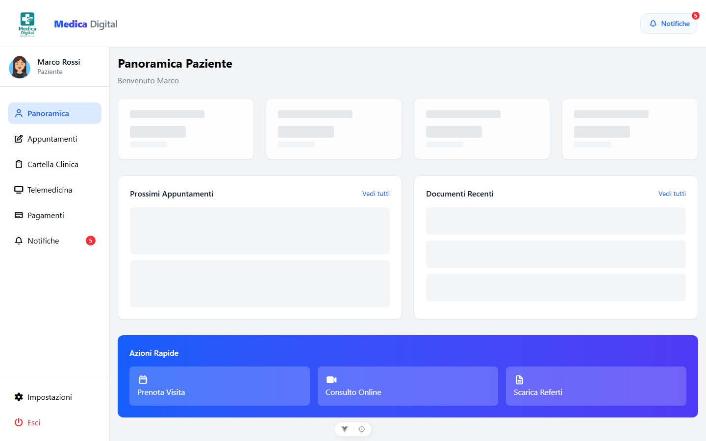
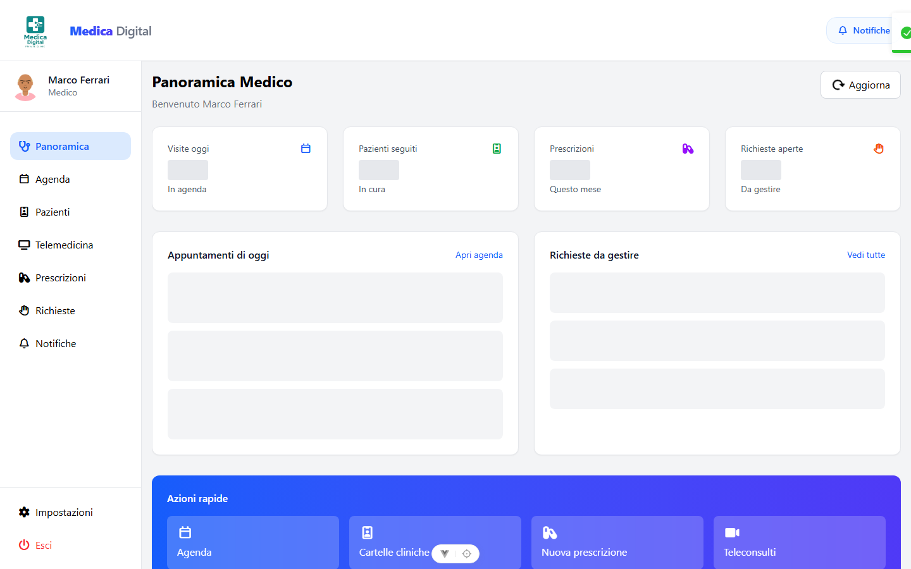
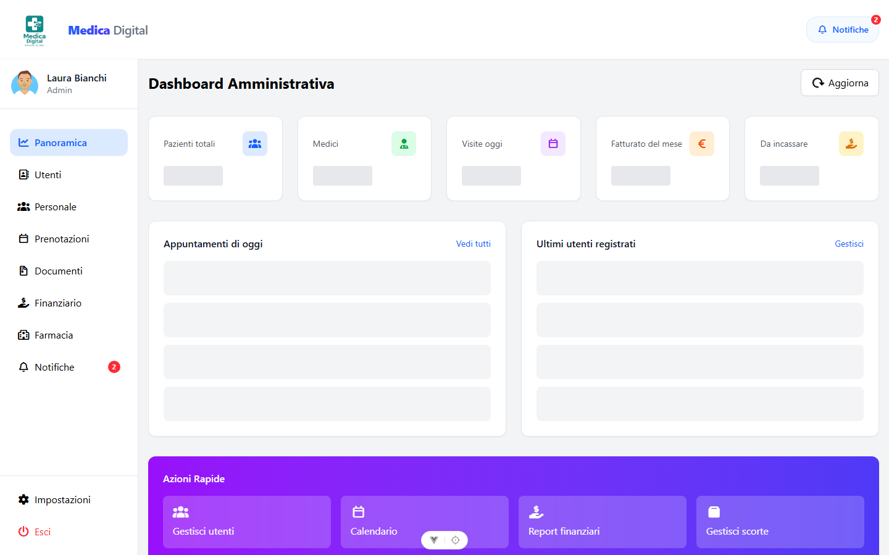

# Gestionale Sanitario

Applicazione web full-stack per la gestione di una struttura sanitaria: agenda e prenotazioni, cartelle cliniche, prescrizioni, magazzino farmaceutico, teleconsulti e fatturazione, con tre aree distinte per **paziente**, **medico** e **amministrazione**.

Progetto realizzato come consegna universitaria.

**Stack:** Vue 3 (Composition API) · Vite 8 · Tailwind CSS 4 · Pinia 3 · Vue Router 5 — API REST Laravel 12 · Laravel Sanctum · MySQL

---

## Indice

- [Screenshot](#screenshot)
- [Funzionalità](#funzionalità)
- [Architettura](#architettura)
- [Requisiti](#requisiti)
- [Installazione](#installazione)
- [Utenti demo](#utenti-demo)
- [Test](#test)
- [Struttura del progetto](#struttura-del-progetto)
- [API](#api)
- [Licenza](#licenza)

---

## Screenshot

| Area paziente | Area medico | Area amministrazione |
|:---:|:---:|:---:|
|  |  |  |

---

## Funzionalità

### Area paziente
- Panoramica con prossimi appuntamenti e stato della propria posizione
- Prenotazione visite con scelta di medico, data e slot disponibile
- Cartella clinica consultabile in timeline, con download dei referti
- Teleconsulti con chat integrata
- Pagamenti e storico fatture

### Area medico
- Agenda giornaliera e settimanale
- Elenco dei propri assistiti e relative cartelle cliniche
- Prescrizioni con numerazione progressiva
- Triage delle richieste dei pazienti: presa in carico, risposta, conversione in teleconsulto
- Gestione delle sessioni di telemedicina

### Area amministrazione
- Gestione utenti e personale medico
- Prenotazioni della struttura
- Archivio documentale con firma singola e massiva
- Magazzino farmaceutico con movimenti di carico/scarico e soglie di scorta minima
- Reportistica finanziaria e incassi per metodo di pagamento

### Trasversali
- Autenticazione a token (Sanctum) con rinnovo automatico e logout su token scaduto
- Autorizzazioni per ruolo applicate sia lato API (Policy + middleware) sia lato router
- Centro notifiche con badge e conteggio dei non letti
- Interfaccia responsive, pensata mobile-first

---

## Architettura

### Frontend

Il frontend è una SPA indipendente che dialoga con il backend solo via API REST.

- **Router modulare** — un file per area (`admin`, `medici`, `pazienti`, `home`), tutte le viste in lazy loading via `() => import()`.
- **Guard di accesso isolata** in `router/guard.js`: è una funzione pura che riceve la rotta e *restituisce* la destinazione invece di chiamare `router.push()`. Questo la rende testabile senza far navigare un router reale, ed evita le doppie navigazioni che annullano la prima.
- **Client HTTP unico** in `services/http.js`: nessun componente importa axios direttamente. Si occupa di baseURL, iniezione del token, normalizzazione degli errori in una forma sola per tutta la UI e logout automatico sul 401.
- **CRUD fattorizzato** in `composables/useResource.js` e `useApiRequest.js`: le viste descrivono cosa mostrare, non come chiamare l'API.
- **Store Pinia** con persistenza limitata al solo token di sessione (`persist.pick`): i dati utente vengono sempre riletti dal server.

L'app viene montata solo dopo che la sessione è stata verificata e il router ha risolto la prima navigazione, così non c'è lo sfarfallio tra login e dashboard.

### Backend

API versionate sotto `/api/v1`, autenticazione Sanctum in modalità token (`Authorization: Bearer`), nessun cookie e nessun CSRF.

- **Policy** per ogni risorsa: il paziente accede solo ai propri dati, il medico solo ai propri assistiti, l'admin alla struttura.
- **Middleware** `role` (filtro d'area), `active` (blocca gli account sospesi revocando il token), `audit` (log delle attività).
- **Service layer** per la logica non banale: disponibilità degli slot e prenotazione con lock transazionale, magazzino, fatturazione, documenti e firma, notifiche.
- **FormRequest** per la validazione e **JsonResource** per l'output: formato di risposta uniforme, errori sempre in `{ message, errors }`.
- Rate limiting dedicato sul login, oltre a quello generale.
- Fallback che risponde JSON su qualsiasi endpoint inesistente, mai HTML.

---

## Requisiti

| Componente | Versione |
|---|---|
| PHP | 8.2 o superiore |
| Composer | 2.x |
| Node.js | `^20.19.0` oppure `>=22.12.0` |
| npm | 10.x |
| MySQL | 8.x (MariaDB 10.6+ va bene) |

> **Nota su SQLite:** è utilizzabile per un avvio rapido, ma lo scope `PatientRequest::triageOrder()` usa la funzione `FIELD()` di MySQL e va sostituito con un `CASE`.

---

## Installazione

### 1. Backend

```bash
cd med-backend

composer install

# Configurazione
cp .env.example .env
php artisan key:generate
```

Aprire `.env` e impostare le credenziali del database:

```dotenv
DB_CONNECTION=mysql
DB_HOST=127.0.0.1
DB_PORT=3306
DB_DATABASE=med_gestionale
DB_USERNAME=root
DB_PASSWORD=
```

Creare lo schema e popolarlo:

```bash
php artisan migrate:fresh --seed
php artisan serve                 # http://localhost:8000
```

### 2. Frontend

In un secondo terminale:

```bash
cd med-frontend/vue-project

npm install
cp .env.example .env

npm run dev                       # http://localhost:5173
```

In sviluppo le chiamate partono da `/api/v1` sulla stessa origine e Vite le inoltra a `http://localhost:8000` (proxy configurato in `vite.config.js`): non serve configurare CORS.

### 3. Build di produzione

```bash
cd med-frontend/vue-project
npm run build                     # output in dist/
npm run preview                   # anteprima locale della build
```

In produzione va impostata `VITE_API_URL` con il dominio reale dell'API.

---

## Utenti demo

Creati da `php artisan migrate:fresh --seed`. Password: **`password`**

| Ruolo | Email | Nome |
|---|---|---|
| Amministrazione | `admin@clinica.it` | Laura Bianchi |
| Medico | `medico@clinica.it` | Marco Ferrari |
| Paziente | `paziente@clinica.it` | Marco Rossi |

Se gli account si disallineano (password dimenticata, profilo scollegato) esistono due comandi dedicati:

```bash
php artisan users:demo --reset    # ricrea/ripristina i tre account e i profili collegati
php artisan med:diagnosi          # diagnostica lo stato dei dati
php artisan med:diagnosi --fix    # ricrea i profili paziente/medico mancanti
```

---

## Test

### Backend — PHPUnit

```bash
cd med-backend
php artisan test
```

Copre autenticazione, ruoli e permessi, ciclo di fatturazione, prenotazioni, profili, relazioni Eloquent, scope dei model e Policy.

### Frontend — Vitest

```bash
cd med-frontend/vue-project
npm test                          # esecuzione singola
npm run test:watch                # in watch
```

Copre la guard del router, lo store di autenticazione e le viste di login e prenotazione.

### Frontend — Playwright (end-to-end)

Richiede **backend e frontend entrambi avviati**.

```bash
npm run e2e                       # esecuzione headless
npm run e2e:ui                    # interfaccia interattiva
npm run e2e:report                # apre l'ultimo report
```

Copre accesso e sessione, le tre dashboard, il layout responsive e il flusso di prenotazione.

---

## Struttura del progetto

```
.
├── med-backend/                  API REST Laravel 12
│   ├── app/
│   │   ├── Console/Commands/     comandi artisan (users:demo, med:diagnosi)
│   │   ├── Http/
│   │   │   ├── Controllers/Api/V1/   14 controller REST
│   │   │   ├── Middleware/           role, active, audit
│   │   │   ├── Requests/             validazione in ingresso
│   │   │   └── Resources/            serializzazione in uscita
│   │   ├── Models/               21 model con relazioni, scope e accessor
│   │   ├── Policies/             autorizzazioni per risorsa
│   │   └── Services/             logica di dominio
│   ├── database/
│   │   ├── migrations/           18 migration
│   │   ├── factories/
│   │   └── seeders/
│   ├── routes/api.php            API v1
│   └── tests/                    Feature + Unit
│
└── med-frontend/vue-project/     SPA Vue 3
    ├── src/
    │   ├── components/
    │   │   ├── layouts/          AuthLayout, LoginLayout, DefaultLayout, navbar, sidebar
    │   │   ├── shared/           ImpostazioniProfilo, NotificheCenter
    │   │   └── ui/               BaseButton, BaseCard, BaseInput, ListaTag
    │   ├── composables/          useResource, useApiRequest, useToast, formatter…
    │   ├── config/sidebar.js     voci di menu per ruolo
    │   ├── data/roles.js         configurazione dei tre ruoli
    │   ├── router/               index + guard + modules/
    │   ├── services/             http.js + api/
    │   ├── store/                auth, dashboard, notifications
    │   ├── views/                26 viste, una per rotta
    │   └── CSS_GLOBAL/main.css   Tailwind v4 + override globali
    └── tests/                    Vitest (unit) + Playwright (e2e)
```

---

## API

Tutti gli endpoint sono sotto `/api/v1`. Tranne il login, richiedono l'header `Authorization: Bearer <token>`.

| Gruppo | Endpoint principali |
|---|---|
| Autenticazione | `POST /auth/login` · `GET /auth/me` · `POST /auth/refresh` · `POST /auth/logout` · `POST /auth/logout-all` · `PUT /auth/profile` · `PUT /auth/password` |
| Dashboard | `GET /dashboard` — un solo endpoint, il contenuto cambia in base al ruolo |
| Notifiche | `GET /notifications` · `GET /notifications/unread-count` · `POST /notifications/read-all` |
| Utenti | `apiResource /users` *(solo admin)* |
| Pazienti | `apiResource /patients` · `GET /patients/me` · `GET /patients/{id}/timeline` |
| Medici | `apiResource /doctors` · `GET /doctors/specializations` · `GET /doctors/{id}/availability` |
| Appuntamenti | `apiResource /appointments` · `POST /appointments/{id}/cancel` |
| Cartella clinica | `apiResource /medical-records` |
| Documenti | `apiResource /documents` · `GET /documents/counters` · `POST /documents/{id}/sign` · `POST /documents/sign-bulk` · `GET /documents/{id}/download` |
| Prescrizioni | `apiResource /prescriptions` |
| Farmacia | `apiResource /medicines` · `GET /medicines/summary` · `GET|POST /medicines/{id}/movements` |
| Richieste (triage) | `apiResource /requests` · `POST /requests/{id}/claim` · `POST /requests/{id}/respond` · `POST /requests/{id}/convert-appointment` |
| Telemedicina | `GET|POST /telemedicine` · `POST /telemedicine/{id}/join|start|end` · `GET|POST /telemedicine/{id}/messages` |
| Fatturazione | `apiResource /invoices` · `POST /invoices/{id}/pay` · `GET /invoices/report` |

Gli errori hanno sempre la stessa forma:

```json
{
  "message": "I dati inviati non sono validi.",
  "errors": { "email": ["Il campo email è obbligatorio."] }
}
```

---

## Licenza

Distribuito con licenza MIT.
