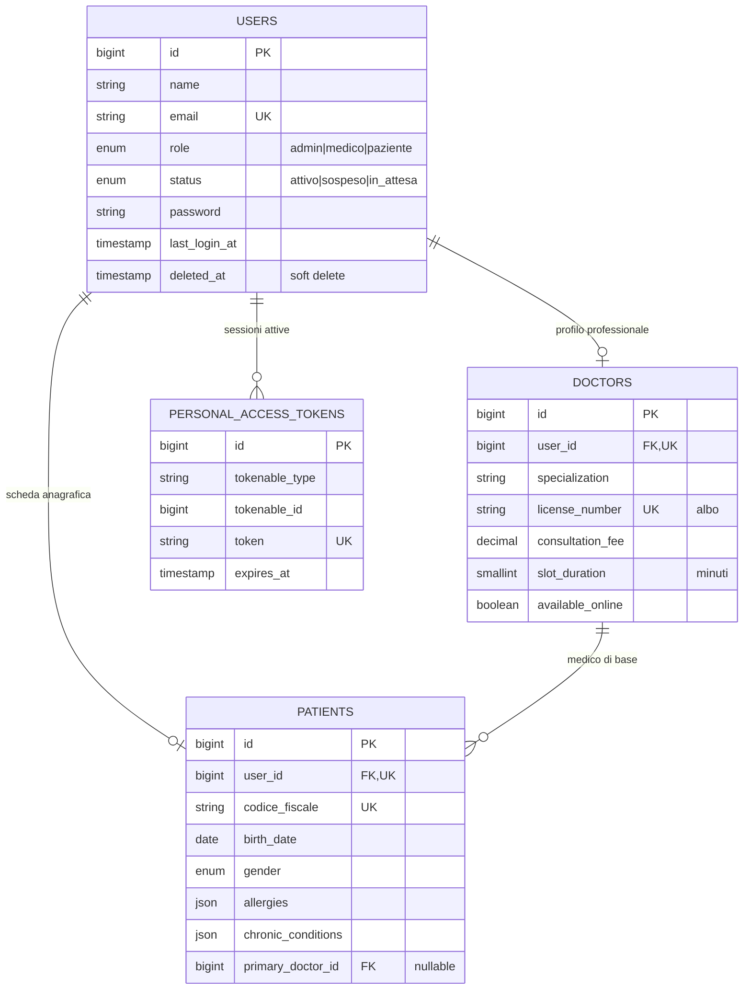
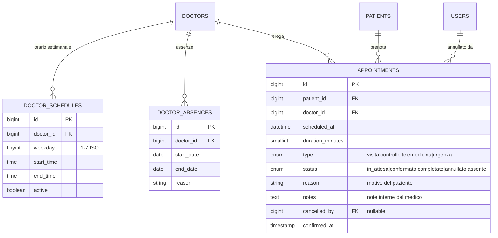
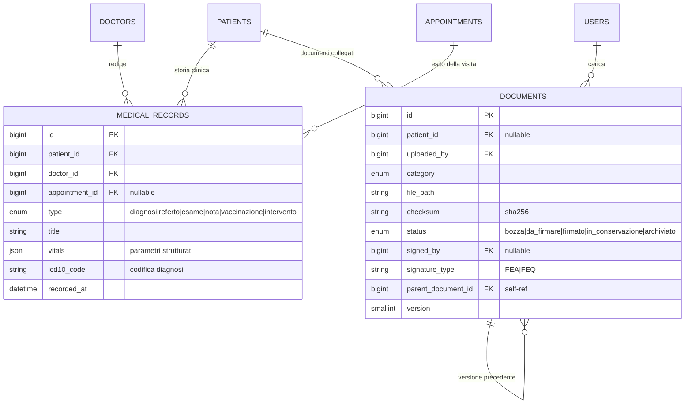
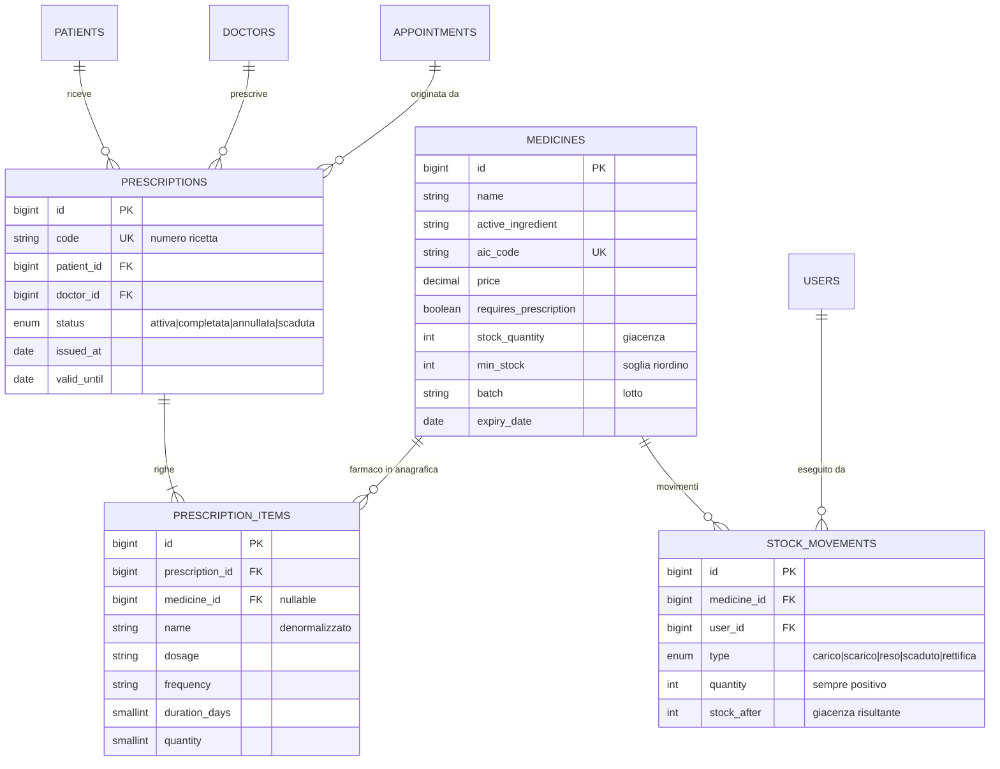
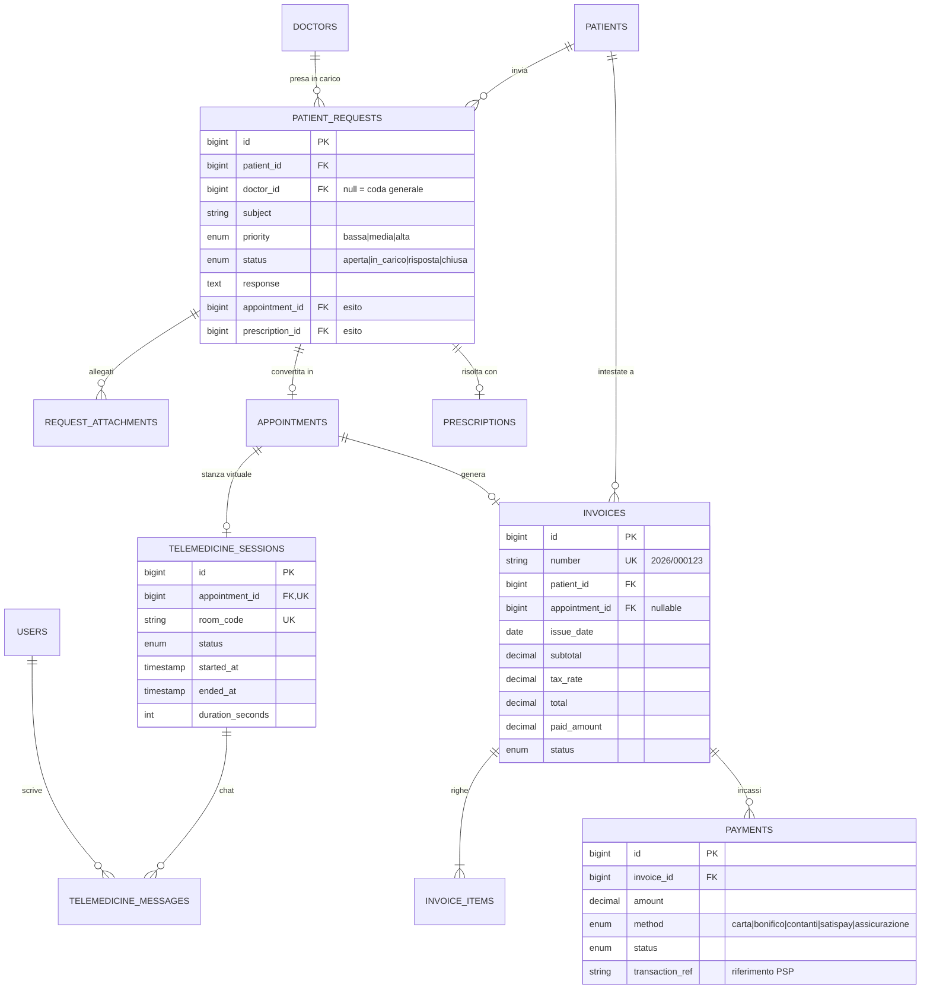
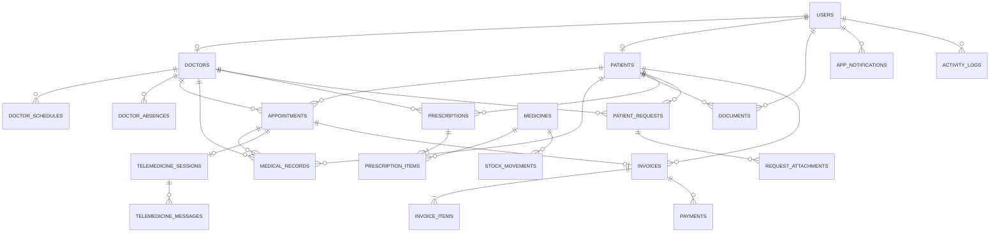

# Modello dei dati

Documentazione del livello di persistenza del gestionale sanitario: schema relazionale, diagrammi entità-relazione, vincoli di integrità e motivazione delle scelte progettuali.

Lo schema è definito in 18 file di migration Laravel sotto `med-backend/database/migrations/`. Le migration sono la **fonte di verità**: questo documento le descrive, non le sostituisce.

---

## Indice

- [1. Convenzioni di notazione](#1-convenzioni-di-notazione)
- [2. Diagrammi ER per area funzionale](#2-diagrammi-er-per-area-funzionale)
- [3. Schema relazionale](#3-schema-relazionale)
- [4. Vincoli di integrità referenziale](#4-vincoli-di-integrità-referenziale)
- [5. Scelte progettuali](#5-scelte-progettuali)
- [6. Normalizzazione e denormalizzazioni deliberate](#6-normalizzazione-e-denormalizzazioni-deliberate)

---

## 1. Convenzioni di notazione

La cardinalità nei diagrammi ER segue la notazione **crow's foot**:

| Simbolo Mermaid | Significato |
|---|---|
| `\|\|--o{` | uno a molti, con lato "molti" opzionale (0..N) |
| `\|\|--\|{` | uno a molti, con lato "molti" obbligatorio (1..N) |
| `\|\|--o\|` | uno a uno, con lato destro opzionale (0..1) |
| `\|\|--\|\|` | uno a uno obbligatorio |

Nello schema relazionale della sezione 3 si adotta la notazione:

```
NomeTabella(chiave_primaria, attributo, attributo, chiave_esterna → TabellaRiferita)
```

- la **chiave primaria** è il primo attributo elencato, in *corsivo grassetto*
- le **chiavi esterne** sono seguite da `→` e dalla tabella riferita
- gli attributi con vincolo `UNIQUE` sono marcati con `(U)`
- gli attributi che ammettono `NULL` sono marcati con `(N)`
- la dicitura `[SD]` a fine riga indica che la tabella adotta il **soft delete** (colonna `deleted_at`)

Tutte le tabelle, salvo dove indicato, includono le colonne di servizio `created_at` e `updated_at` gestite automaticamente da Eloquent; non vengono ripetute per leggibilità.

---

## 2. Diagrammi ER per area funzionale

Lo schema completo conta 22 tabelle applicative: un unico diagramma risulterebbe illeggibile. Si presentano cinque viste per area funzionale, seguite dalla mappa d'insieme.

### 2.1 Anagrafiche e accessi

L'entità `users` contiene esclusivamente le credenziali e il ruolo. I dati specifici di dominio vivono nei profili collegati, in relazione **1:0..1** — un account amministratore non possiede né scheda medico né scheda paziente.



La relazione `DOCTORS ||--o{ PATIENTS` rappresenta l'assegnazione del medico di base ed è **opzionale su entrambi i lati**: un paziente può non averlo assegnato, un medico può non averne in carico.

### 2.2 Agenda e prestazioni



La disponibilità di uno slot **non è una tabella**: è calcolata a runtime da `AppointmentService::availableSlots()` intersecando `doctor_schedules`, `doctor_absences` e gli `appointments` già presi. La motivazione è nella sezione 5.3.

### 2.3 Area clinica e documentale



`DOCUMENTS` presenta una **relazione ricorsiva** (`parent_document_id`): ogni documento può sostituire una versione precedente, costruendo una catena di revisioni. In ambito sanitario il documento superato non viene eliminato ma conservato, perché la versione firmata all'epoca ha valore probatorio.

### 2.4 Farmacia e prescrizioni



`PRESCRIPTION_ITEMS.medicine_id` è **nullable** mentre `name` è obbligatorio: il medico deve poter prescrivere un farmaco non presente in magazzino. Vedi sezione 6.2.

### 2.5 Richieste, telemedicina e amministrazione



`PATIENT_REQUESTS` ha **due esiti alternativi e opzionali**: una richiesta può risolversi in un appuntamento, in una prescrizione, in una semplice risposta testuale, o restare aperta. Le due chiavi esterne modellano la tracciabilità dell'esito senza imporre che ce ne sia uno.

`TELEMEDICINE_SESSIONS.appointment_id` è `UNIQUE`: la relazione con `APPOINTMENTS` è **1:0..1**, un appuntamento genera al più una stanza virtuale.

### 2.6 Mappa d'insieme

Vista ad alto livello delle sole entità e delle loro dipendenze, senza attributi.



Si osservi che `USERS`, `PATIENTS`, `DOCTORS` e `APPOINTMENTS` costituiscono il nucleo da cui dipende ogni altra area: sono le quattro entità con il maggior numero di archi entranti.

---

## 3. Schema relazionale

Le tabelle che seguono sono la **traduzione in schema logico** dei diagrammi della sezione precedente. Ogni entità diventa una relazione; ogni associazione 1:N si traduce in una chiave esterna sul lato "molti"; le associazioni 1:0..1 sono rese con una chiave esterna vincolata `UNIQUE` sul lato dipendente — è il caso di `doctors.user_id`, `patients.user_id` e `telemedicine_sessions.appointment_id`.

### 3.1 Area anagrafica e accessi

> ***users***(**_id_**, name, email (U), role, status, password, phone (N), avatar_path (N), last_login_at (N), email_verified_at (N)) `[SD]`

> ***doctors***(**_id_**, user_id (U) → users, specialization, license_number (U,N), bio (N), consultation_fee, slot_duration, available_online) `[SD]`

> ***patients***(**_id_**, user_id (U) → users, codice_fiscale (U,N), birth_date (N), gender (N), birth_place (N), address (N), city (N), province (N), postal_code (N), blood_type (N), allergies (N), chronic_conditions (N), notes (N), emergency_contact_name (N), emergency_contact_phone (N), primary_doctor_id (N) → doctors) `[SD]`

> ***personal_access_tokens***(**_id_**, tokenable_type, tokenable_id, name, token (U), abilities (N), last_used_at (N), expires_at (N))

**Domini enumerati**
- `users.role` ∈ {`admin`, `medico`, `paziente`}
- `users.status` ∈ {`attivo`, `sospeso`, `in_attesa`}
- `patients.gender` ∈ {`M`, `F`, `altro`}

### 3.2 Area agenda e prestazioni

> ***doctor_schedules***(**_id_**, doctor_id → doctors, weekday, start_time, end_time, active)
> — vincolo `UNIQUE(doctor_id, weekday, start_time)`

> ***doctor_absences***(**_id_**, doctor_id → doctors, start_date, end_date, reason (N))

> ***appointments***(**_id_**, patient_id → patients, doctor_id → doctors, scheduled_at, duration_minutes, type, status, reason (N), notes (N), cancellation_reason (N), cancelled_by (N) → users, confirmed_at (N)) `[SD]`

**Domini enumerati**
- `appointments.type` ∈ {`visita`, `controllo`, `telemedicina`, `urgenza`}
- `appointments.status` ∈ {`in_attesa`, `confermato`, `completato`, `annullato`, `assente`}

### 3.3 Area clinica e documentale

> ***medical_records***(**_id_**, patient_id → patients, doctor_id → doctors, appointment_id (N) → appointments, type, title, description (N), vitals (N), icd10_code (N), recorded_at) `[SD]`

> ***documents***(**_id_**, patient_id (N) → patients, uploaded_by → users, category, title, description (N), file_path, original_name, mime_type, size, checksum (N), status, signed_by (N) → users, signed_at (N), signature_type (N), archived_at (N), parent_document_id (N) → documents, version) `[SD]`

**Domini enumerati**
- `medical_records.type` ∈ {`diagnosi`, `referto`, `esame`, `nota`, `vaccinazione`, `intervento`}
- `documents.category` ∈ {`consenso`, `referto`, `fattura`, `contratto`, `certificazione`, `altro`}
- `documents.status` ∈ {`bozza`, `da_firmare`, `firmato`, `in_conservazione`, `archiviato`}

### 3.4 Area farmaceutica e prescrittiva

> ***medicines***(**_id_**, name, active_ingredient (N), aic_code (U,N), form (N), dosage (N), manufacturer (N), price, requires_prescription, stock_quantity, min_stock, batch (N), expiry_date (N), active) `[SD]`

> ***stock_movements***(**_id_**, medicine_id → medicines, user_id → users, type, quantity, stock_after, reason (N))

> ***prescriptions***(**_id_**, code (U), patient_id → patients, doctor_id → doctors, appointment_id (N) → appointments, status, notes (N), issued_at, valid_until (N)) `[SD]`

> ***prescription_items***(**_id_**, prescription_id → prescriptions, medicine_id (N) → medicines, name, dosage (N), frequency (N), duration_days (N), quantity, notes (N))

**Domini enumerati**
- `stock_movements.type` ∈ {`carico`, `scarico`, `reso`, `scaduto`, `rettifica`}
- `prescriptions.status` ∈ {`attiva`, `completata`, `annullata`, `scaduta`}

### 3.5 Area richieste e telemedicina

> ***patient_requests***(**_id_**, patient_id → patients, doctor_id (N) → doctors, subject, description, priority, status, response (N), responded_at (N), appointment_id (N) → appointments, prescription_id (N) → prescriptions) `[SD]`

> ***request_attachments***(**_id_**, patient_request_id → patient_requests, file_path, original_name, mime_type, size)

> ***telemedicine_sessions***(**_id_**, appointment_id (U) → appointments, room_code (U), status, started_at (N), ended_at (N), duration_seconds (N), notes (N))

> ***telemedicine_messages***(**_id_**, telemedicine_session_id → telemedicine_sessions, user_id → users, body, read_at (N))

**Domini enumerati**
- `patient_requests.priority` ∈ {`bassa`, `media`, `alta`}
- `patient_requests.status` ∈ {`aperta`, `in_carico`, `risposta`, `chiusa`}
- `telemedicine_sessions.status` ∈ {`programmata`, `in_corso`, `terminata`, `annullata`}

### 3.6 Area amministrativa

> ***invoices***(**_id_**, number (U), patient_id → patients, appointment_id (N) → appointments, issue_date, due_date (N), subtotal, tax_rate, tax_amount, total, paid_amount, status, notes (N)) `[SD]`

> ***invoice_items***(**_id_**, invoice_id → invoices, description, quantity, unit_price, total)

> ***payments***(**_id_**, invoice_id → invoices, amount, method, status, transaction_ref (N), paid_at (N))

**Domini enumerati**
- `invoices.status` ∈ {`bozza`, `emessa`, `pagata`, `parziale`, `scaduta`, `stornata`}
- `payments.method` ∈ {`carta`, `bonifico`, `contanti`, `satispay`, `assicurazione`}
- `payments.status` ∈ {`in_attesa`, `completato`, `fallito`, `rimborsato`}

### 3.7 Tabelle trasversali

> ***app_notifications***(**_id_**, user_id → users, category, level, title, body (N), link (N), read_at (N))

> ***activity_logs***(**_id_**, user_id (N) → users, action, subject_type (N), subject_id (N), properties (N), ip_address (N), user_agent (N))

`activity_logs` adotta una **relazione polimorfa**: la coppia `(subject_type, subject_id)` può puntare a qualsiasi entità del sistema, senza che sia dichiarata una chiave esterna verso una tabella specifica. È il compromesso necessario per un registro di audit che deve tracciare indistintamente la firma di un documento, l'apertura di una cartella clinica o la modifica di un account.

---

## 4. Vincoli di integrità referenziale

La politica di cancellazione non è uniforme: è stata scelta relazione per relazione in base al significato del dato.

### 4.1 `CASCADE` — il dato figlio non ha senso senza il padre

| Relazione | Motivazione |
|---|---|
| `doctors.user_id → users` | il profilo professionale è un'estensione dell'account |
| `patients.user_id → users` | idem per la scheda anagrafica |
| `doctor_schedules.doctor_id → doctors` | un orario senza medico non è interpretabile |
| `prescription_items.prescription_id → prescriptions` | le righe non esistono fuori dalla ricetta |
| `invoice_items.invoice_id → invoices` | idem per le righe di fattura |
| `payments.invoice_id → invoices` | un incasso è sempre riferito a una fattura |
| `telemedicine_messages.session_id` | la chat appartiene alla sessione |
| `app_notifications.user_id → users` | notifica senza destinatario |

### 4.2 `SET NULL` — il riferimento è accessorio, il dato resta valido

| Relazione | Motivazione |
|---|---|
| `patients.primary_doctor_id → doctors` | se il medico lascia la struttura, il paziente resta: il campo va semplicemente riassegnato |
| `medical_records.appointment_id` | il referto conserva valore clinico anche se la visita collegata viene rimossa |
| `prescription_items.medicine_id` | il farmaco può uscire dall'anagrafica: la ricetta storica deve restare leggibile |
| `appointments.cancelled_by → users` | serve sapere *che* è stato annullato, non necessariamente da chi per sempre |
| `documents.signed_by` / `parent_document_id` | la catena di versioni sopravvive alla rimozione di un nodo |
| `invoices.appointment_id` | la fattura ha vita contabile autonoma |

### 4.3 Vincoli di unicità applicativi

| Vincolo | Significato di dominio |
|---|---|
| `users.email` | identifica univocamente l'account |
| `patients.codice_fiscale` | identificativo fiscale della persona |
| `doctors.license_number` | numero di iscrizione all'albo |
| `medicines.aic_code` | codice AIC ministeriale del farmaco |
| `prescriptions.code` | numero ricetta progressivo |
| `invoices.number` | numerazione fiscale progressiva |
| `telemedicine_sessions.room_code` | codice stanza, non indovinabile |
| `telemedicine_sessions.appointment_id` | impone la cardinalità 1:0..1 |
| `doctor_schedules(doctor_id, weekday, start_time)` | impedisce due fasce identiche sovrapposte |

### 4.4 Indici di supporto alle query

Gli indici non sono stati aggiunti a tappeto, ma derivati dalle interrogazioni effettivamente presenti nei service:

| Indice | Query che serve |
|---|---|
| `appointments(doctor_id, scheduled_at)` | agenda del medico per data — la query più frequente dell'applicazione |
| `appointments(patient_id, scheduled_at)` | storico appuntamenti del paziente |
| `medical_records(patient_id, recorded_at)` | timeline della cartella clinica |
| `app_notifications(user_id, read_at, created_at)` | badge dei non letti, ordinati per data |
| `stock_movements(medicine_id, created_at)` | estratto conto di magazzino di un farmaco |
| `users(role, status)` | elenchi filtrati del pannello amministrativo |
| `medicines(expiry_date)` | alert sui lotti in scadenza |

---

## 5. Scelte progettuali

### 5.1 Separazione fra account e profilo di dominio

`users` contiene solo autenticazione e ruolo; `doctors` e `patients` contengono i dati specifici. L'alternativa — una tabella unica con colonne nullable per entrambi i ruoli — sarebbe stata più semplice ma avrebbe prodotto una tabella sparsa, con `codice_fiscale` e `specialization` sempre nulli per due utenti su tre.

La separazione ha inoltre una conseguenza operativa: cambiare il ruolo di un account non richiede di spostare dati, e un utente può essere sospeso (`status`) senza toccare la sua storia clinica.

### 5.2 Soft delete come requisito di dominio

Tutte le tabelle che contengono dati clinici, fiscali o anagrafici adottano il soft delete. Non è una precauzione generica: in ambito sanitario la documentazione è soggetta a obblighi di conservazione, e una fattura emessa non può essere eliminata ma solo stornata (`status = 'stornata'`).

Le tabelle **senza** soft delete sono quelle puramente accessorie — `doctor_schedules`, `stock_movements`, `telemedicine_messages`, `app_notifications`, `activity_logs`, e le tabelle di dettaglio `invoice_items` e `prescription_items` — che vivono e muoiono con il proprio padre.

### 5.3 La disponibilità non è persistita

Non esiste una tabella `slots`. Gli slot prenotabili sono calcolati al volo intersecando orario settimanale, assenze e appuntamenti esistenti.

Il motivo è che una tabella di slot precalcolati sarebbe **ridondante e soggetta a disallineamento**: ogni modifica all'orario del medico imporrebbe di rigenerare le disponibilità future, e una rigenerazione fallita o parziale produrrebbe slot fantasma. Il calcolo a runtime ha un costo trascurabile su una giornata di lavoro (poche decine di slot) e non può mai divergere dalla realtà.

Il prezzo di questa scelta è la necessità di gestire la concorrenza in fase di prenotazione: è il motivo del blocco pessimistico descritto in 5.4.

### 5.4 Concorrenza in prenotazione

La prenotazione avviene dentro una transazione con blocco pessimistico sulla riga del medico:

```php
return DB::transaction(function () use ($data) {
    $doctor = Doctor::lockForUpdate()->findOrFail($data['doctor_id']);
    // ... ricontrollo disponibilità e inserimento
});
```

Senza il `lockForUpdate`, due richieste simultanee per lo stesso slot potrebbero entrambe superare il controllo di disponibilità e inserire due appuntamenti sovrapposti. Il vincolo di unicità a livello di database non è applicabile qui, perché la sovrapposizione è una condizione su un **intervallo** (`scheduled_at` + `duration_minutes`), non su un valore puntuale.

Il comportamento è verificato dai test `due pazienti non possono occupare lo stesso slot` e `anche una sovrapposizione parziale viene respinta`.

### 5.5 Colonne JSON per dati semi-strutturati

`patients.allergies`, `patients.chronic_conditions` e `medical_records.vitals` sono colonne JSON.

La normalizzazione avrebbe richiesto tre tabelle di dettaglio per dati che sono **sempre letti insieme al record padre e mai interrogati singolarmente**: l'applicazione non ha mai bisogno di rispondere a "quanti pazienti sono allergici alla penicillina". Se quel requisito emergesse, la migrazione a tabelle dedicate sarebbe il passo successivo naturale.

`vitals` ha in più una giustificazione di dominio: i parametri rilevati variano per tipo di prestazione — pressione e frequenza per una visita cardiologica, valori ematici per un esame di laboratorio — e uno schema rigido a colonne fisse sarebbe in gran parte vuoto.

### 5.6 Enum a livello di database

Gli stati (`appointments.status`, `invoices.status`, e gli altri) sono `ENUM` di MySQL, non tabelle di lookup.

La motivazione è che si tratta di **stati del dominio, non di dati configurabili dall'utente**: aggiungere uno stato richiede comunque di scrivere il codice che lo gestisce, quindi una migration è il luogo corretto in cui dichiararlo. Una tabella di lookup darebbe l'illusione che si possano aggiungere stati a runtime, cosa che romperebbe le transizioni implementate nei service.

Le costanti corrispondenti sono dichiarate nei model (`Appointment::STATUS_COMPLETATO`), così che il valore stringa non compaia mai letterale nel codice applicativo.

---

## 6. Normalizzazione e denormalizzazioni deliberate

Lo schema è in **terza forma normale**, con tre eccezioni volute. Ciascuna è documentata qui perché una denormalizzazione non dichiarata è un errore, mentre una denormalizzazione motivata è una decisione progettuale.

### 6.1 `stock_movements.stock_after`

La giacenza risultante dopo il movimento è ricavabile sommando tutti i movimenti precedenti, quindi è formalmente ridondante rispetto a `medicines.stock_quantity`.

**Perché è stata mantenuta:** il magazzino farmaceutico richiede tracciabilità. Registrare la giacenza al momento del movimento consente di ricostruire lo stato dell'inventario a una data passata e, soprattutto, di **individuare le incoerenze**: se la somma dei movimenti non corrisponde a `stock_quantity`, c'è stata una modifica fuori dal flusso previsto. La ridondanza è qui uno strumento di controllo, non una svista.

### 6.2 `prescription_items.name`

Il nome del farmaco è duplicato rispetto a `medicines.name`, che sarebbe raggiungibile tramite `medicine_id`.

**Perché è stata mantenuta:** una ricetta è un documento con valore legale e deve restare leggibile esattamente com'è stata emessa. Se il farmaco viene rinominato in anagrafica, o rimosso, o se il medico prescrive un prodotto mai censito, la riga della ricetta deve conservare il testo originale. È la stessa logica per cui una fattura conserva la descrizione della prestazione anziché puntare a un listino che può cambiare.

### 6.3 `invoices.total` e `invoices.paid_amount`

Il totale è ricavabile sommando `invoice_items.total`; l'importo pagato sommando i `payments` completati.

**Perché sono stati mantenuti:** oltre alla ragione di prestazione — la dashboard amministrativa aggrega centinaia di fatture e un totale precalcolato evita una sottoquery per riga — vale la stessa ragione legale del punto precedente. Il totale di una fattura emessa è un dato fiscale cristallizzato, che non deve cambiare se in futuro si corregge un'aliquota o si modifica una riga.

La coerenza è garantita da `InvoiceService`, che è l'unico punto autorizzato a scrivere queste colonne, ed è verificata dai test del ciclo di fatturazione (`saldo totale porta la fattura a pagata`, `acconto porta la fattura a parziale`, `da incassare tiene conto degli acconti`).

---

## 7. Riepilogo quantitativo

| Metrica | Valore |
|---|---|
| Tabelle applicative | 22 |
| File di migration | 18 |
| Relazioni con chiave esterna | 30 |
| Relazioni ricorsive | 1 (`documents`) |
| Relazioni polimorfe | 2 (`activity_logs`, `personal_access_tokens`) |
| Tabelle con soft delete | 11 |
| Vincoli di unicità di dominio | 9 |
| Indici composti espliciti | 10 |
| Colonne JSON | 4 |

---

*Documento generato a partire dalle migration in `med-backend/database/migrations/`. In caso di divergenza, fa fede il codice.*
