# Diagrammi UML

Modellazione del sistema secondo la notazione UML: casi d'uso, classi, sequenza, stati e componenti.

Il modello dei dati — entità, relazioni e schema relazionale — è documentato separatamente in [`02-modello-dati.md`](02-modello-dati.md).

---

## Indice

- [1. Diagramma dei casi d'uso](#1-diagramma-dei-casi-duso)
- [2. Diagramma delle classi](#2-diagramma-delle-classi)
- [3. Diagrammi di sequenza](#3-diagrammi-di-sequenza)
- [4. Diagrammi di stato](#4-diagrammi-di-stato)
- [5. Diagramma dei componenti](#5-diagramma-dei-componenti)

---

## 1. Diagramma dei casi d'uso

### 1.1 Attori

Il sistema riconosce tre attori, corrispondenti ai tre valori dell'attributo `role` dell'entità `users`. Non esistono utenti non autenticati oltre alla schermata di accesso: ogni rotta dell'API, con l'unica eccezione del login, richiede un token valido.

| Attore | Descrizione | Perimetro di accesso |
|---|---|---|
| **Paziente** | Assistito della struttura | Esclusivamente i propri dati |
| **Medico** | Professionista sanitario | I propri assistiti e i pazienti già visitati |
| **Amministrazione** | Personale di segreteria e direzione | L'intera struttura |

Gli attori **non sono in relazione di generalizzazione fra loro**: l'amministrazione non è un "super-paziente" e non eredita i suoi casi d'uso. Un amministratore non ha una cartella clinica e non può prenotare per sé stesso; può prenotare *per conto di* un paziente, che è un caso d'uso distinto. È una scelta di modellazione che riflette il codice: i tre ruoli si escludono a vicenda, come verificato dal test `gli helper di ruolo si escludono a vicenda`.

### 1.2 Casi d'uso del Paziente

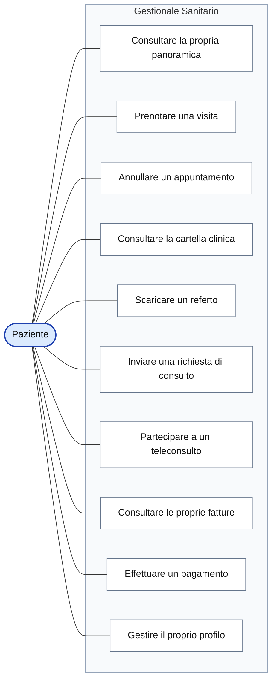
```mermaid
flowchart LR
    P([Paziente])

    subgraph SISTEMA[" Gestionale Sanitario "]
        direction TB
        UC1[Consultare la propria panoramica]
        UC2[Prenotare una visita]
        UC3[Annullare un appuntamento]
        UC4[Consultare la cartella clinica]
        UC5[Scaricare un referto]
        UC6[Inviare una richiesta di consulto]
        UC7[Partecipare a un teleconsulto]
        UC8[Consultare le proprie fatture]
        UC9[Effettuare un pagamento]
        UC10[Gestire il proprio profilo]
    end

    P --- UC1
    P --- UC2
    P --- UC3
    P --- UC4
    P --- UC5
    P --- UC6
    P --- UC7
    P --- UC8
    P --- UC9
    P --- UC10

    classDef attore fill:#dbeafe,stroke:#1e40af,stroke-width:2px,color:#111
    classDef uc fill:#fff,stroke:#64748b,stroke-width:1px,color:#111
    class P attore
    class UC1,UC2,UC3,UC4,UC5,UC6,UC7,UC8,UC9,UC10 uc
    style SISTEMA fill:#f8fafc,stroke:#94a3b8,stroke-width:2px
```

Il caso d'uso **Prenotare una visita** include la consultazione delle disponibilità del medico: non è un'operazione separata ma un passaggio obbligato del flusso, perché il sistema non accetta una prenotazione su uno slot che non ha proposto.

### 1.3 Casi d'uso del Medico

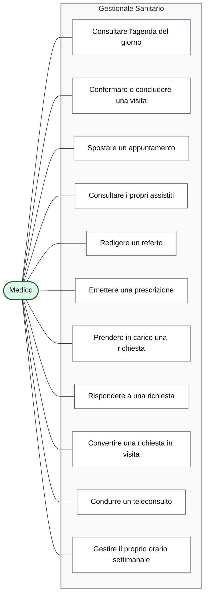
```mermaid
flowchart LR
    M([Medico])

    subgraph SISTEMA[" Gestionale Sanitario "]
        direction TB
        UC1[Consultare l'agenda del giorno]
        UC2[Confermare o concludere una visita]
        UC3[Spostare un appuntamento]
        UC4[Consultare i propri assistiti]
        UC5[Redigere un referto]
        UC6[Emettere una prescrizione]
        UC7[Prendere in carico una richiesta]
        UC8[Rispondere a una richiesta]
        UC9[Convertire una richiesta in visita]
        UC10[Condurre un teleconsulto]
        UC11[Gestire il proprio orario settimanale]
    end

    M --- UC1
    M --- UC2
    M --- UC3
    M --- UC4
    M --- UC5
    M --- UC6
    M --- UC7
    M --- UC8
    M --- UC9
    M --- UC10
    M --- UC11

    classDef attore fill:#dcfce7,stroke:#166534,stroke-width:2px,color:#111
    classDef uc fill:#fff,stroke:#64748b,stroke-width:1px,color:#111
    class M attore
    class UC1,UC2,UC3,UC4,UC5,UC6,UC7,UC8,UC9,UC10,UC11 uc
    style SISTEMA fill:#f8fafc,stroke:#94a3b8,stroke-width:2px
```

**Concludere una visita** ha un effetto che non appartiene al medico: l'emissione della fattura. Il medico non "fattura", chiude la visita; la conseguenza contabile è automatica ed è modellata come effetto del cambio di stato, non come caso d'uso. Il meccanismo è descritto nella sequenza 3.3.

### 1.4 Casi d'uso dell'Amministrazione

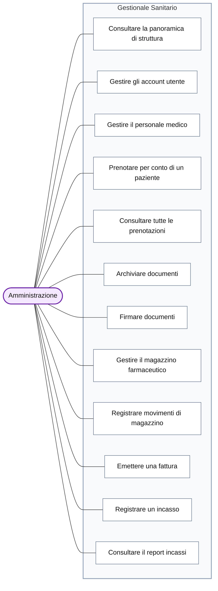
```mermaid
flowchart LR
    A([Amministrazione])

    subgraph SISTEMA[" Gestionale Sanitario "]
        direction TB
        UC1[Consultare la panoramica di struttura]
        UC2[Gestire gli account utente]
        UC3[Gestire il personale medico]
        UC4[Prenotare per conto di un paziente]
        UC5[Consultare tutte le prenotazioni]
        UC6[Archiviare documenti]
        UC7[Firmare documenti]
        UC8[Gestire il magazzino farmaceutico]
        UC9[Registrare movimenti di magazzino]
        UC10[Emettere una fattura]
        UC11[Registrare un incasso]
        UC12[Consultare il report incassi]
    end

    A --- UC1
    A --- UC2
    A --- UC3
    A --- UC4
    A --- UC5
    A --- UC6
    A --- UC7
    A --- UC8
    A --- UC9
    A --- UC10
    A --- UC11
    A --- UC12

    classDef attore fill:#f3e8ff,stroke:#6b21a8,stroke-width:2px,color:#111
    classDef uc fill:#fff,stroke:#64748b,stroke-width:1px,color:#111
    class A attore
    class UC1,UC2,UC3,UC4,UC5,UC6,UC7,UC8,UC9,UC10,UC11,UC12 uc
    style SISTEMA fill:#f8fafc,stroke:#94a3b8,stroke-width:2px
```

**Firmare documenti** esiste in due varianti — singola e massiva (`POST /documents/sign-bulk`) — che condividono la stessa logica applicativa. Sono qui rappresentate come un unico caso d'uso perché la differenza è di interfaccia, non di dominio.

### 1.5 Casi d'uso condivisi

Tre casi d'uso appartengono a tutti gli attori. Il comportamento del sistema cambia in base al ruolo di chi li esercita, ma il caso d'uso è lo stesso.

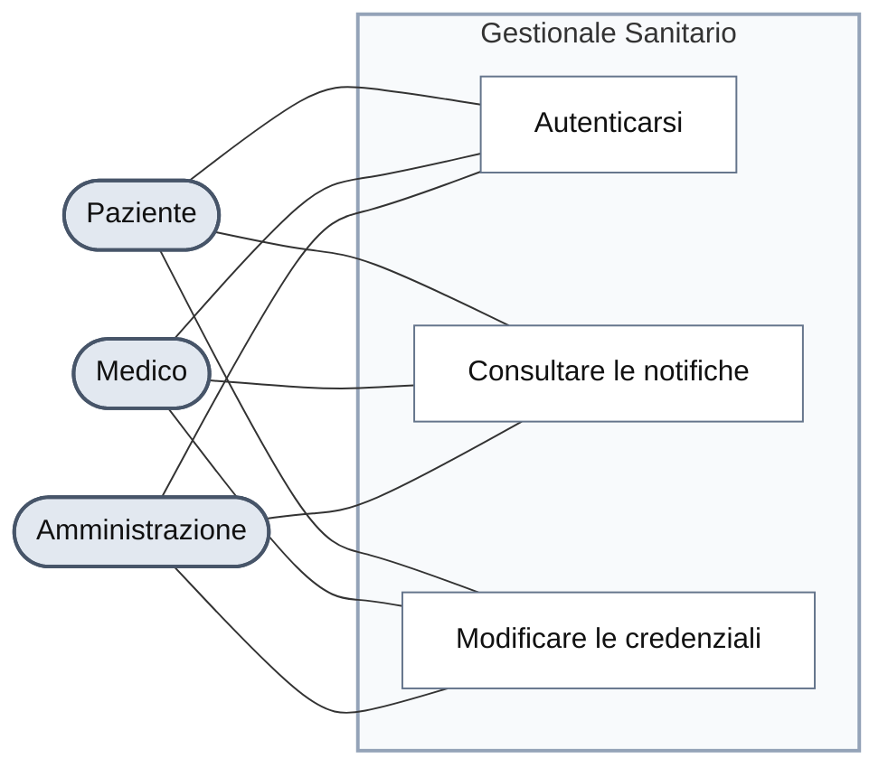
```mermaid
flowchart LR
    P([Paziente])
    M([Medico])
    A([Amministrazione])

    subgraph SISTEMA[" Gestionale Sanitario "]
        direction TB
        UC1[Autenticarsi]
        UC2[Consultare le notifiche]
        UC3[Modificare le credenziali]
    end

    P --- UC1
    M --- UC1
    A --- UC1
    P --- UC2
    M --- UC2
    A --- UC2
    P --- UC3
    M --- UC3
    A --- UC3

    classDef attore fill:#e2e8f0,stroke:#475569,stroke-width:2px,color:#111
    classDef uc fill:#fff,stroke:#64748b,stroke-width:1px,color:#111
    class P,M,A attore
    class UC1,UC2,UC3 uc
    style SISTEMA fill:#f8fafc,stroke:#94a3b8,stroke-width:2px
```

**Consultare la panoramica** è il caso più interessante di questa famiglia: un solo endpoint (`GET /dashboard`) serve i tre ruoli, ed è il backend a decidere il contenuto. La scelta evita che il frontend debba conoscere il ruolo per sapere quale risorsa interrogare.

### 1.6 Scenario principale: prenotazione di una visita

| Voce | Contenuto |
|---|---|
| **Caso d'uso** | Prenotare una visita |
| **Attore primario** | Paziente |
| **Precondizioni** | L'attore è autenticato con ruolo `paziente`, il suo account è `attivo` ed esiste la scheda anagrafica collegata |
| **Postcondizioni** | Esiste un appuntamento in stato `in_attesa`; paziente e medico hanno ricevuto una notifica; se il tipo è `telemedicina` esiste la stanza virtuale |

**Flusso principale**

1. Il paziente consulta l'elenco dei medici, eventualmente filtrando per specializzazione
2. Seleziona un medico e una data
3. Il sistema calcola e mostra gli slot liberi di quella giornata
4. Il paziente sceglie uno slot e indica il motivo della visita
5. Il sistema verifica che lo slot sia ancora libero, acquisendo il blocco sulla riga del medico
6. Il sistema registra l'appuntamento
7. Il sistema notifica paziente e medico

**Flussi alternativi**

| Codice | Condizione | Comportamento |
|---|---|---|
| A1 | Il medico è in ferie nella data richiesta | Nessuno slot proposto; la prenotazione diretta risponde `422` |
| A2 | Il medico non ha fasce attive in quel giorno della settimana | Nessuno slot proposto |
| A3 | Lo slot viene occupato fra il passo 3 e il passo 5 | `422` con messaggio «Lo slot selezionato non è più disponibile» |
| A4 | La data è nel passato | `422` con messaggio esplicito |
| A5 | Il paziente indica un `patient_id` diverso dal proprio | `403` |
| A6 | L'account non ha anagrafica collegata | `409` con messaggio diagnostico |

Il flusso A3 è quello che giustifica il blocco pessimistico: senza, due pazienti potrebbero superare entrambi il passo 5.

---

## 2. Diagramma delle classi

### 2.1 Nucleo del dominio

Rappresenta le entità centrali con i metodi significativi. Sono omessi i getter e setter generati da Eloquent e le colonne di servizio.

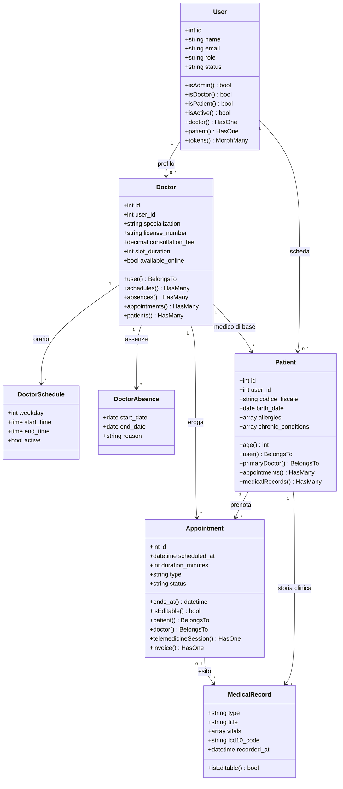
```mermaid
classDiagram
    class User {
        +int id
        +string name
        +string email
        +string role
        +string status
        +isAdmin() bool
        +isDoctor() bool
        +isPatient() bool
        +isActive() bool
        +doctor() HasOne
        +patient() HasOne
        +tokens() MorphMany
    }

    class Doctor {
        +int id
        +int user_id
        +string specialization
        +string license_number
        +decimal consultation_fee
        +int slot_duration
        +bool available_online
        +user() BelongsTo
        +schedules() HasMany
        +absences() HasMany
        +appointments() HasMany
        +patients() HasMany
    }

    class Patient {
        +int id
        +int user_id
        +string codice_fiscale
        +date birth_date
        +array allergies
        +array chronic_conditions
        +age() int
        +user() BelongsTo
        +primaryDoctor() BelongsTo
        +appointments() HasMany
        +medicalRecords() HasMany
    }

    class Appointment {
        +int id
        +datetime scheduled_at
        +int duration_minutes
        +string type
        +string status
        +ends_at() datetime
        +isEditable() bool
        +patient() BelongsTo
        +doctor() BelongsTo
        +telemedicineSession() HasOne
        +invoice() HasOne
    }

    class DoctorSchedule {
        +int weekday
        +time start_time
        +time end_time
        +bool active
    }

    class DoctorAbsence {
        +date start_date
        +date end_date
        +string reason
    }

    class MedicalRecord {
        +string type
        +string title
        +array vitals
        +string icd10_code
        +datetime recorded_at
        +isEditable() bool
    }

    User "1" --> "0..1" Doctor : profilo
    User "1" --> "0..1" Patient : scheda
    Doctor "1" --> "*" DoctorSchedule : orario
    Doctor "1" --> "*" DoctorAbsence : assenze
    Doctor "1" --> "*" Appointment : eroga
    Patient "1" --> "*" Appointment : prenota
    Doctor "0..1" --> "*" Patient : medico di base
    Patient "1" --> "*" MedicalRecord : storia clinica
    Appointment "0..1" --> "*" MedicalRecord : esito
```

La relazione fra `User` e i due profili è **1:0..1 esclusiva**: un account ha un profilo medico, oppure una scheda paziente, oppure nessuno dei due se è amministrativo. Il vincolo di esclusività non è espresso nello schema del database — sarebbe un vincolo di tipo `CHECK` complesso — ma è garantito dalla logica applicativa e verificato dal test `gli helper di ruolo si escludono a vicenda`.

### 2.2 Area amministrativa e farmaceutica

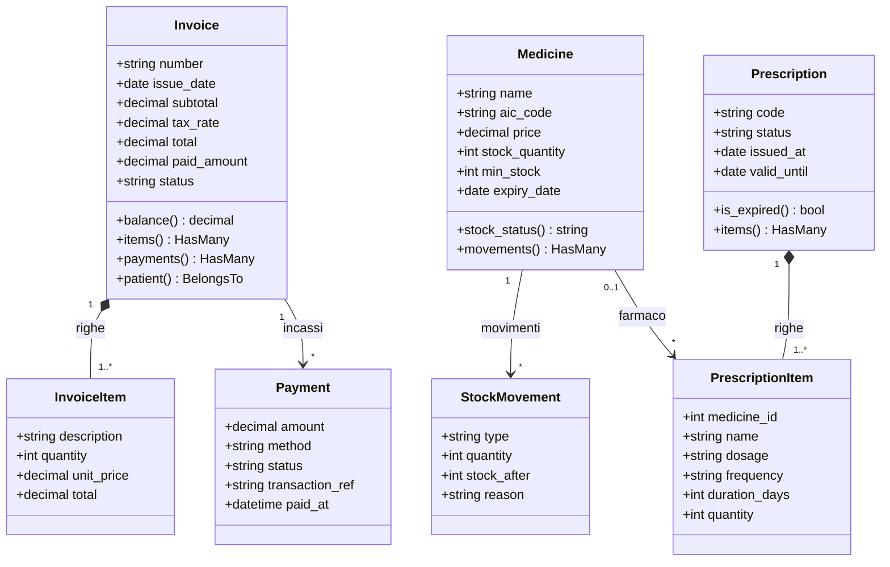
```mermaid
classDiagram
    class Invoice {
        +string number
        +date issue_date
        +decimal subtotal
        +decimal tax_rate
        +decimal total
        +decimal paid_amount
        +string status
        +balance() decimal
        +items() HasMany
        +payments() HasMany
        +patient() BelongsTo
    }

    class InvoiceItem {
        +string description
        +int quantity
        +decimal unit_price
        +decimal total
    }

    class Payment {
        +decimal amount
        +string method
        +string status
        +string transaction_ref
        +datetime paid_at
    }

    class Medicine {
        +string name
        +string aic_code
        +decimal price
        +int stock_quantity
        +int min_stock
        +date expiry_date
        +stock_status() string
        +movements() HasMany
    }

    class StockMovement {
        +string type
        +int quantity
        +int stock_after
        +string reason
    }

    class Prescription {
        +string code
        +string status
        +date issued_at
        +date valid_until
        +is_expired() bool
        +items() HasMany
    }

    class PrescriptionItem {
        +int medicine_id
        +string name
        +string dosage
        +string frequency
        +int duration_days
        +int quantity
    }

    Invoice "1" *-- "1..*" InvoiceItem : righe
    Invoice "1" --> "*" Payment : incassi
    Medicine "1" --> "*" StockMovement : movimenti
    Prescription "1" *-- "1..*" PrescriptionItem : righe
    Medicine "0..1" --> "*" PrescriptionItem : farmaco
```

Le righe di fattura e di prescrizione sono legate al padre da **composizione** (rombo pieno): non hanno vita autonoma e vengono eliminate con esso. Il legame fra `PrescriptionItem` e `Medicine` è invece una semplice associazione opzionale, perché la riga sopravvive alla rimozione del farmaco dall'anagrafica — conserva il nome in chiaro.

### 2.3 Architettura a livelli

Questo diagramma non rappresenta singole classi ma il **pattern strutturale** che si ripete per ogni risorsa. Al posto dei nomi concreti — `AppointmentController`, `StoreAppointmentRequest`, `AppointmentPolicy` — compaiono i ruoli architetturali.

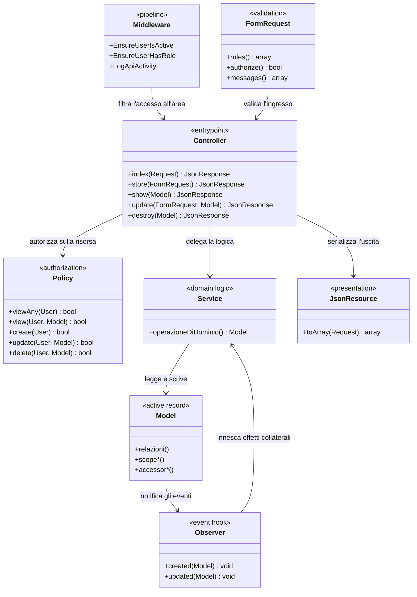
```mermaid
classDiagram
    class Middleware {
        <<pipeline>>
        +EnsureUserIsActive
        +EnsureUserHasRole
        +LogApiActivity
    }

    class FormRequest {
        <<validation>>
        +rules() array
        +authorize() bool
        +messages() array
    }

    class Controller {
        <<entrypoint>>
        +index(Request) JsonResponse
        +store(FormRequest) JsonResponse
        +show(Model) JsonResponse
        +update(FormRequest, Model) JsonResponse
        +destroy(Model) JsonResponse
    }

    class Policy {
        <<authorization>>
        +viewAny(User) bool
        +view(User, Model) bool
        +create(User) bool
        +update(User, Model) bool
        +delete(User, Model) bool
    }

    class Service {
        <<domain logic>>
        +operazioneDiDominio() Model
    }

    class Model {
        <<active record>>
        +relazioni()
        +scope*()
        +accessor*()
    }

    class JsonResource {
        <<presentation>>
        +toArray(Request) array
    }

    class Observer {
        <<event hook>>
        +created(Model) void
        +updated(Model) void
    }

    Middleware --> Controller : filtra l'accesso all'area
    FormRequest --> Controller : valida l'ingresso
    Controller --> Policy : autorizza sulla risorsa
    Controller --> Service : delega la logica
    Service --> Model : legge e scrive
    Model --> Observer : notifica gli eventi
    Observer --> Service : innesca effetti collaterali
    Controller --> JsonResource : serializza l'uscita
```

Il percorso di una richiesta attraversa i livelli in ordine fisso: **middleware → validazione → policy → service → model**, e ritorna attraverso la **resource**.

Le due frecce che escono da `Observer` meritano attenzione: sono il solo punto in cui il flusso non è lineare. Un evento sul model innesca un service che opera su un'altra area del dominio — è il meccanismo che collega agenda e contabilità, descritto nella sequenza 3.3.

**Perché due livelli di autorizzazione.** Il middleware risponde a «questo ruolo può accedere a quest'area?» e blocca prima di qualsiasi query. La policy risponde a «questo utente può agire su questo record?» e richiede che la risorsa sia già caricata. Il primo è economico e grossolano, il secondo è preciso e costoso: usarli in sequenza significa non pagare il costo del secondo quando basta il primo.

### 2.4 Il livello dei service

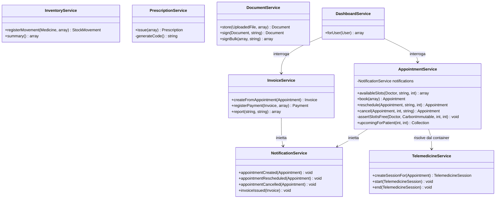
```mermaid
classDiagram
    class AppointmentService {
        -NotificationService notifications
        +availableSlots(Doctor, string, int) array
        +book(array) Appointment
        +reschedule(Appointment, string, int) Appointment
        +cancel(Appointment, int, string) Appointment
        -assertSlotIsFree(Doctor, CarbonImmutable, int, int) void
        +upcomingForPatient(int, int) Collection
    }

    class InvoiceService {
        +createFromAppointment(Appointment) Invoice
        +registerPayment(Invoice, array) Payment
        +report(string, string) array
    }

    class NotificationService {
        +appointmentCreated(Appointment) void
        +appointmentRescheduled(Appointment) void
        +appointmentCancelled(Appointment) void
        +invoiceIssued(Invoice) void
    }

    class TelemedicineService {
        +createSessionFor(Appointment) TelemedicineSession
        +start(TelemedicineSession) void
        +end(TelemedicineSession) void
    }

    class InventoryService {
        +registerMovement(Medicine, array) StockMovement
        +summary() array
    }

    class PrescriptionService {
        +issue(array) Prescription
        -generateCode() string
    }

    class DocumentService {
        +store(UploadedFile, array) Document
        +sign(Document, string) Document
        +signBulk(array, string) array
    }

    class DashboardService {
        +forUser(User) array
    }

    AppointmentService --> NotificationService : inietta
    AppointmentService --> TelemedicineService : risolve dal container
    InvoiceService --> NotificationService : inietta
    DashboardService --> AppointmentService : interroga
    DashboardService --> InvoiceService : interroga
```

Le dipendenze sono iniettate dal costruttore e dichiarate `private readonly`: un service non può sostituire le proprie collaborazioni dopo la costruzione, e questo rende esplicito il grafo delle dipendenze.

`AppointmentService` risolve `TelemedicineService` dal container anziché riceverlo dal costruttore. È una scelta consapevole: la telemedicina serve solo nel ramo in cui il tipo di appuntamento è `telemedicina`, e iniettarla sempre significherebbe istanziarla anche per le visite ordinarie.

---

## 3. Diagrammi di sequenza

### 3.1 Prenotazione di una visita con controllo di concorrenza

Lo scenario rappresenta il caso critico: due pazienti che tentano lo stesso slot nello stesso istante.

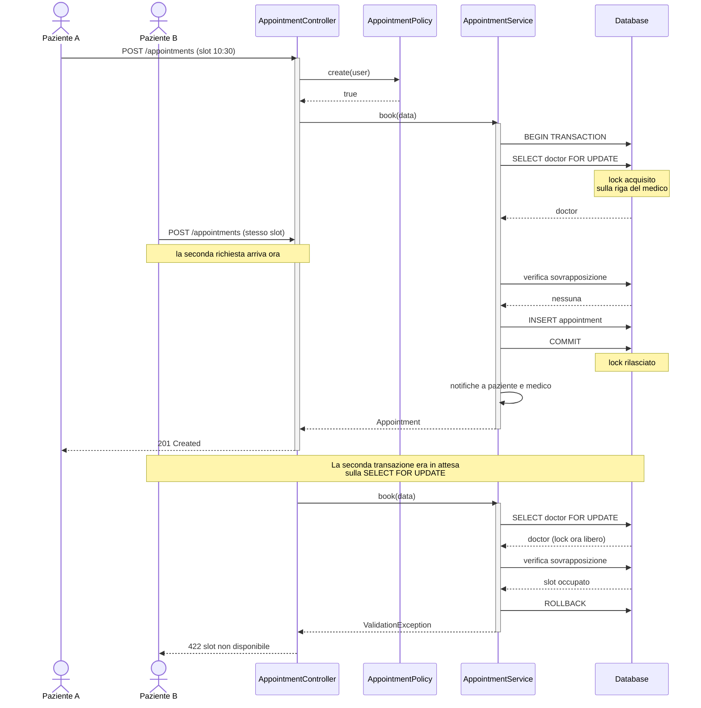
```mermaid
sequenceDiagram
    actor P1 as Paziente A
    actor P2 as Paziente B
    participant API as AppointmentController
    participant POL as AppointmentPolicy
    participant SRV as AppointmentService
    participant DB as Database

    P1->>API: POST /appointments (slot 10:30)
    activate API
    API->>POL: create(user)
    POL-->>API: true
    API->>SRV: book(data)
    activate SRV

    SRV->>DB: BEGIN TRANSACTION
    SRV->>DB: SELECT doctor FOR UPDATE
    Note over DB: lock acquisito<br/>sulla riga del medico
    DB-->>SRV: doctor

    P2->>API: POST /appointments (stesso slot)
    Note over P2,API: la seconda richiesta arriva ora

    SRV->>DB: verifica sovrapposizione
    DB-->>SRV: nessuna
    SRV->>DB: INSERT appointment
    SRV->>DB: COMMIT
    Note over DB: lock rilasciato

    SRV->>SRV: notifiche a paziente e medico
    SRV-->>API: Appointment
    deactivate SRV
    API-->>P1: 201 Created
    deactivate API

    Note over P2,DB: La seconda transazione era in attesa<br/>sulla SELECT FOR UPDATE
    API->>SRV: book(data)
    activate SRV
    SRV->>DB: SELECT doctor FOR UPDATE
    DB-->>SRV: doctor (lock ora libero)
    SRV->>DB: verifica sovrapposizione
    DB-->>SRV: slot occupato
    SRV->>DB: ROLLBACK
    SRV-->>API: ValidationException
    deactivate SRV
    API-->>P2: 422 slot non disponibile
```

Il punto decisivo è che la seconda transazione, quando riprende dopo il rilascio del lock, **rilegge** lo stato del database. Senza il lock avrebbe letto lo stato precedente all'inserimento della prima e avrebbe concluso che lo slot era libero.

### 3.2 Autenticazione con protezione dal brute force

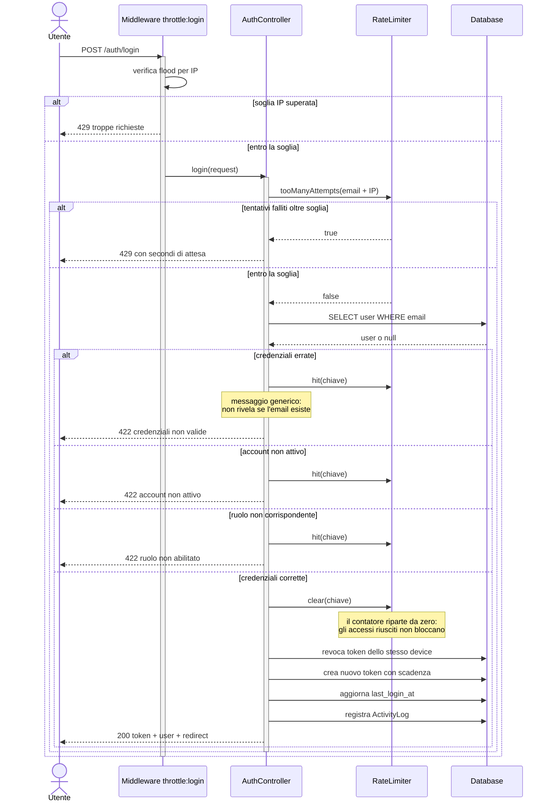
```mermaid
sequenceDiagram
    actor U as Utente
    participant MW as Middleware throttle:login
    participant AC as AuthController
    participant RL as RateLimiter
    participant DB as Database

    U->>MW: POST /auth/login
    activate MW
    MW->>MW: verifica flood per IP
    alt soglia IP superata
        MW-->>U: 429 troppe richieste
    else entro la soglia
        MW->>AC: login(request)
        activate AC

        AC->>RL: tooManyAttempts(email + IP)
        alt tentativi falliti oltre soglia
            RL-->>AC: true
            AC-->>U: 429 con secondi di attesa
        else entro la soglia
            RL-->>AC: false
            AC->>DB: SELECT user WHERE email
            DB-->>AC: user o null

            alt credenziali errate
                AC->>RL: hit(chiave)
                Note over AC: messaggio generico:<br/>non rivela se l'email esiste
                AC-->>U: 422 credenziali non valide
            else account non attivo
                AC->>RL: hit(chiave)
                AC-->>U: 422 account non attivo
            else ruolo non corrispondente
                AC->>RL: hit(chiave)
                AC-->>U: 422 ruolo non abilitato
            else credenziali corrette
                AC->>RL: clear(chiave)
                Note over RL: il contatore riparte da zero:<br/>gli accessi riusciti non bloccano
                AC->>DB: revoca token dello stesso device
                AC->>DB: crea nuovo token con scadenza
                AC->>DB: aggiorna last_login_at
                AC->>DB: registra ActivityLog
                AC-->>U: 200 token + user + redirect
            end
        end
        deactivate AC
    end
    deactivate MW
```

I tre rami di fallimento incrementano tutti il contatore. Se non lo facessero, i percorsi "account non attivo" e "ruolo non corrispondente" offrirebbero un canale non limitato per sondare quali indirizzi email siano registrati.

### 3.3 Conclusione della visita ed emissione automatica della fattura

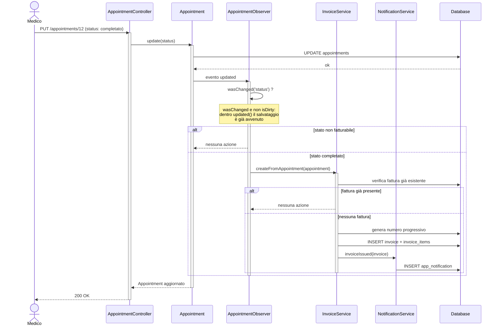
```mermaid
sequenceDiagram
    actor M as Medico
    participant API as AppointmentController
    participant A as Appointment
    participant OBS as AppointmentObserver
    participant IS as InvoiceService
    participant NS as NotificationService
    participant DB as Database

    M->>API: PUT /appointments/12 (status: completato)
    activate API
    API->>A: update(status)
    activate A
    A->>DB: UPDATE appointments
    DB-->>A: ok

    A->>OBS: evento updated
    activate OBS
    OBS->>OBS: wasChanged('status') ?
    Note over OBS: wasChanged e non isDirty:<br/>dentro updated() il salvataggio<br/>è già avvenuto

    alt stato non fatturabile
        OBS-->>A: nessuna azione
    else stato completato
        OBS->>IS: createFromAppointment(appointment)
        activate IS
        IS->>DB: verifica fattura già esistente
        alt fattura già presente
            IS-->>OBS: nessuna azione
        else nessuna fattura
            IS->>DB: genera numero progressivo
            IS->>DB: INSERT invoice + invoice_items
            IS->>NS: invoiceIssued(invoice)
            NS->>DB: INSERT app_notification
        end
        deactivate IS
    end
    deactivate OBS

    A-->>API: Appointment aggiornato
    deactivate A
    API-->>M: 200 OK
    deactivate API
```

L'emissione della fattura **non blocca** la chiusura della visita: se il service fallisce, registra l'errore e il flusso prosegue. Impedire a un medico di concludere una prestazione erogata perché il modulo contabile ha un problema sarebbe una scelta sbagliata.

### 3.4 Gestione del token scaduto lato frontend

Sequenza interamente client-side, che mostra come l'interceptor e il router collaborino senza conoscersi.

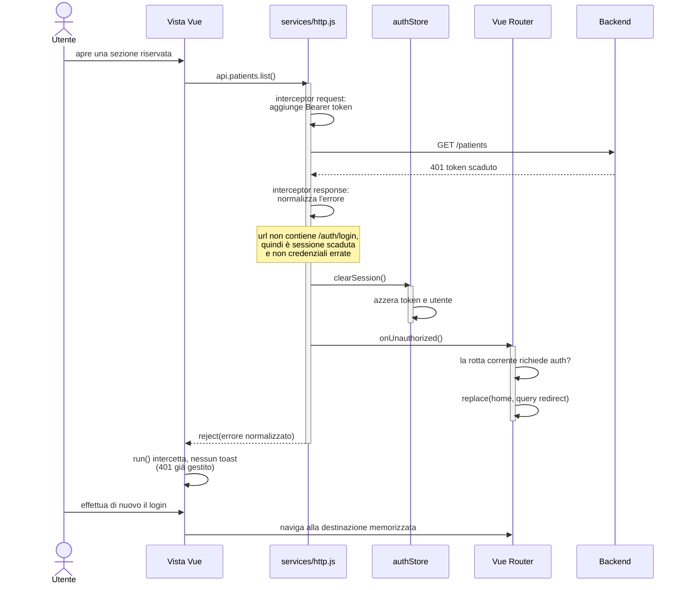
```mermaid
sequenceDiagram
    actor U as Utente
    participant V as Vista Vue
    participant HTTP as services/http.js
    participant AS as authStore
    participant R as Vue Router
    participant API as Backend

    U->>V: apre una sezione riservata
    V->>HTTP: api.patients.list()
    activate HTTP
    HTTP->>HTTP: interceptor request:<br/>aggiunge Bearer token
    HTTP->>API: GET /patients
    API-->>HTTP: 401 token scaduto

    HTTP->>HTTP: interceptor response:<br/>normalizza l'errore
    Note over HTTP: url non contiene /auth/login,<br/>quindi è sessione scaduta<br/>e non credenziali errate

    HTTP->>AS: clearSession()
    activate AS
    AS->>AS: azzera token e utente
    deactivate AS

    HTTP->>R: onUnauthorized()
    activate R
    R->>R: la rotta corrente richiede auth?
    R->>R: replace(home, query redirect)
    deactivate R

    HTTP-->>V: reject(errore normalizzato)
    deactivate HTTP
    V->>V: run() intercetta, nessun toast<br/>(401 già gestito)

    U->>V: effettua di nuovo il login
    V->>R: naviga alla destinazione memorizzata
```

`http.js` non importa il router e il router non importa `http.js`: la comunicazione avviene tramite due callback registrate all'avvio (`registerAuthStore`, `registerUnauthorizedHandler`). Un import diretto creerebbe un ciclo che il bundler risolverebbe con uno dei due moduli parzialmente inizializzato.

---

## 4. Diagrammi di stato

Tre entità del dominio hanno un ciclo di vita a stati con transizioni vincolate. Modellarle esplicitamente serve a rendere evidenti le transizioni **non** ammesse, che sono altrettanto significative di quelle ammesse.

### 4.1 Appuntamento

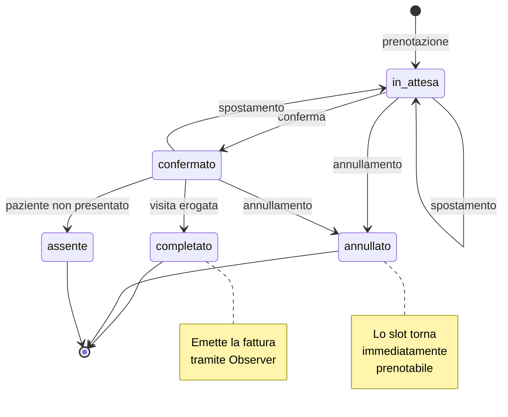
```mermaid
stateDiagram-v2
    [*] --> in_attesa : prenotazione

    in_attesa --> confermato : conferma
    in_attesa --> annullato : annullamento
    in_attesa --> in_attesa : spostamento

    confermato --> completato : visita erogata
    confermato --> assente : paziente non presentato
    confermato --> annullato : annullamento
    confermato --> in_attesa : spostamento

    completato --> [*]
    annullato --> [*]
    assente --> [*]

    note right of completato
        Emette la fattura
        tramite Observer
    end note

    note right of annullato
        Lo slot torna
        immediatamente
        prenotabile
    end note
```

Gli stati `completato`, `annullato` e `assente` sono **terminali**: l'attributo calcolato `isEditable()` restituisce `false` e ogni tentativo di modifica riceve `403`. Il test `una visita conclusa non e piu modificabile` formalizza il vincolo.

Lo spostamento riporta l'appuntamento a `in_attesa` azzerando `confirmed_at`: una visita già confermata su un orario che cambia richiede una nuova conferma.

### 4.2 Fattura

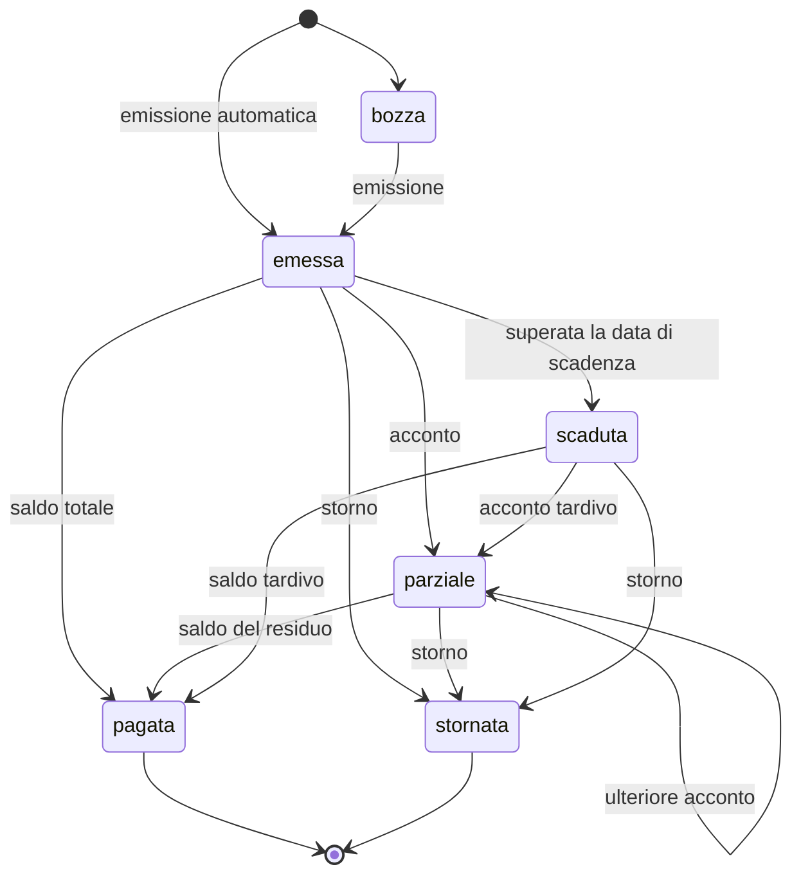
```mermaid
stateDiagram-v2
    [*] --> bozza
    [*] --> emessa : emissione automatica

    bozza --> emessa : emissione
    emessa --> parziale : acconto
    emessa --> pagata : saldo totale
    parziale --> pagata : saldo del residuo
    parziale --> parziale : ulteriore acconto
    emessa --> scaduta : superata la data di scadenza
    scaduta --> parziale : acconto tardivo
    scaduta --> pagata : saldo tardivo

    emessa --> stornata : storno
    parziale --> stornata : storno
    scaduta --> stornata : storno

    pagata --> [*]
    stornata --> [*]
```

Non esiste transizione da `pagata` verso altri stati, e **non esiste alcuna transizione di eliminazione**: una fattura emessa si storna, non si cancella. È un vincolo di natura fiscale prima che tecnica, ed è la ragione per cui `invoices` adotta il soft delete.

La transizione verso `parziale` o `pagata` non è decisa dal chiamante ma calcolata da `InvoiceService` confrontando l'importo incassato con il totale.

### 4.3 Richiesta di consulto

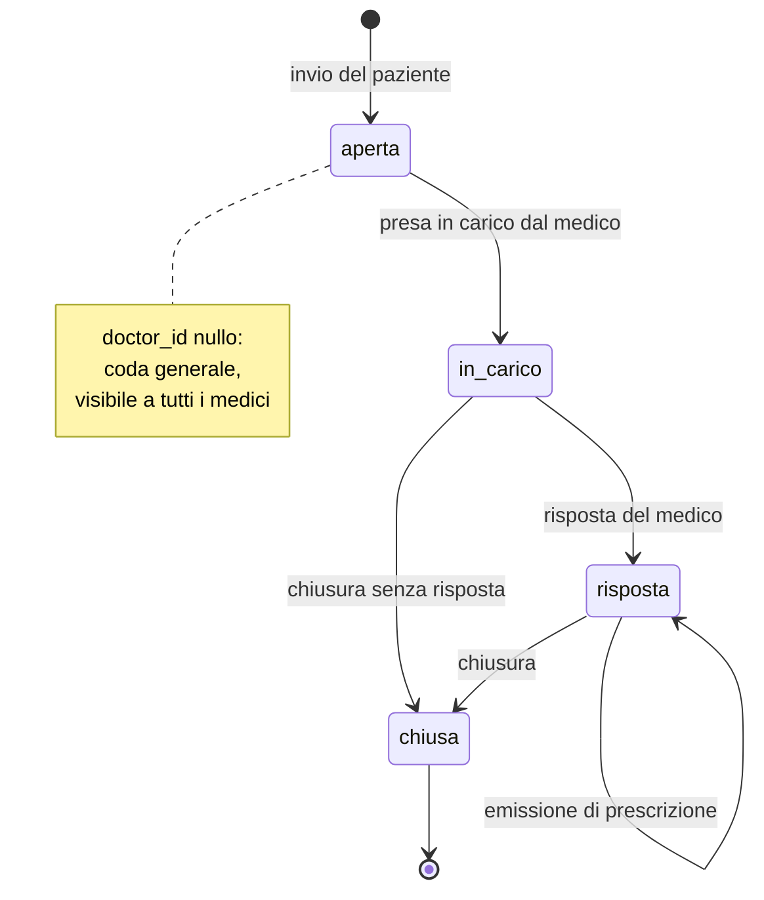
```mermaid
stateDiagram-v2
    [*] --> aperta : invio del paziente

    aperta --> in_carico : presa in carico dal medico
    in_carico --> risposta : risposta del medico
    in_carico --> chiusa : chiusura senza risposta
    risposta --> chiusa : chiusura

    risposta --> risposta : conversione in appuntamento
    risposta --> risposta : emissione di prescrizione

    chiusa --> [*]

    note right of aperta
        doctor_id nullo:
        coda generale,
        visibile a tutti i medici
    end note
```

Una richiesta in stato `aperta` con `doctor_id` nullo è in coda generale. La presa in carico assegna il medico e rende la richiesta invisibile ai colleghi: è una transizione che modifica contemporaneamente stato e proprietà, e il test `una richiesta già assegnata non può essere sottratta` ne verifica l'atomicità.

Le due transizioni riflessive su `risposta` rappresentano gli esiti: la conversione in appuntamento e l'emissione di una prescrizione valorizzano `appointment_id` o `prescription_id` senza cambiare stato, perché la richiesta resta in attesa di chiusura.

---

## 5. Diagramma dei componenti

### 5.1 Architettura di deployment

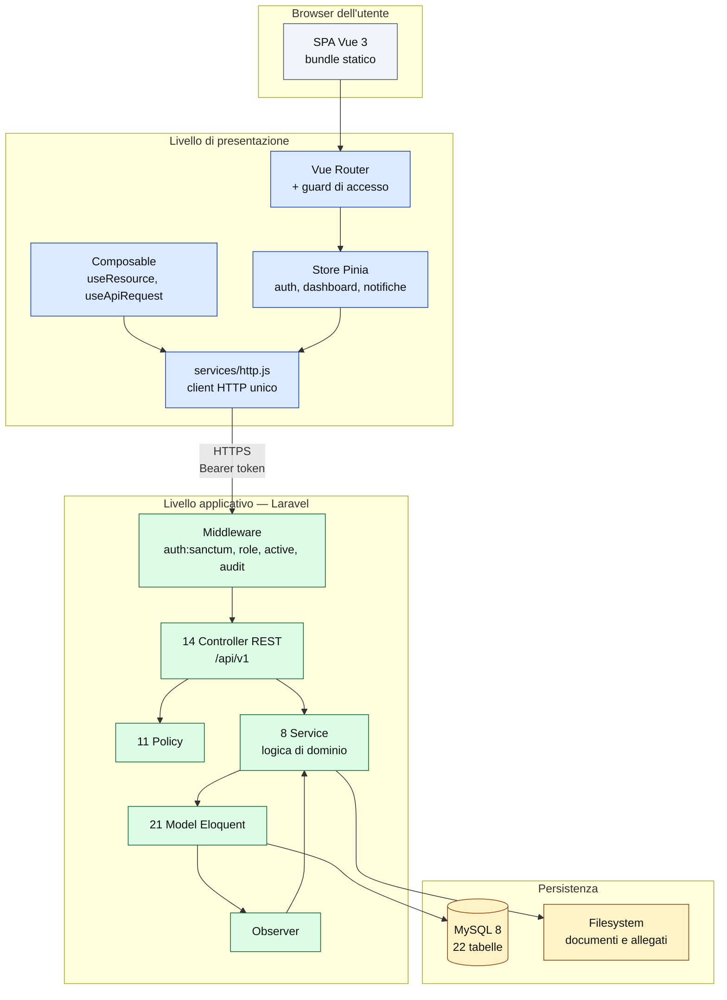
```mermaid
flowchart TB
    subgraph CLIENT["Browser dell'utente"]
        SPA["SPA Vue 3<br/>bundle statico"]
    end

    subgraph FE["Livello di presentazione"]
        ROUTER["Vue Router<br/>+ guard di accesso"]
        STORE["Store Pinia<br/>auth, dashboard, notifiche"]
        HTTP["services/http.js<br/>client HTTP unico"]
        COMP["Composable<br/>useResource, useApiRequest"]
    end

    subgraph BE["Livello applicativo — Laravel"]
        MW["Middleware<br/>auth:sanctum, role, active, audit"]
        CTRL["14 Controller REST<br/>/api/v1"]
        POL["11 Policy"]
        SRV["8 Service<br/>logica di dominio"]
        MOD["21 Model Eloquent"]
        OBS["Observer"]
    end

    subgraph DATA["Persistenza"]
        DB[("MySQL 8<br/>22 tabelle")]
        FS["Filesystem<br/>documenti e allegati"]
    end

    SPA --> ROUTER
    ROUTER --> STORE
    COMP --> HTTP
    STORE --> HTTP
    HTTP -->|"HTTPS<br/>Bearer token"| MW
    MW --> CTRL
    CTRL --> POL
    CTRL --> SRV
    SRV --> MOD
    MOD --> OBS
    OBS --> SRV
    MOD --> DB
    SRV --> FS

    classDef fe fill:#dbeafe,stroke:#1e40af,color:#111
    classDef be fill:#dcfce7,stroke:#166534,color:#111
    classDef data fill:#fef3c7,stroke:#92400e,color:#111
    classDef client fill:#f1f5f9,stroke:#475569,color:#111

    class SPA client
    class ROUTER,STORE,HTTP,COMP fe
    class MW,CTRL,POL,SRV,MOD,OBS be
    class DB,FS data
```

I due livelli comunicano **esclusivamente** via HTTP con token: il backend non serve viste, non conosce le rotte del frontend e non mantiene sessioni. È la caratteristica che rende l'architettura API-based nel senso richiesto dalla traccia, e ha una conseguenza verificabile: il backend è interamente testabile senza aprire un browser.

### 5.2 Ambiente di sviluppo

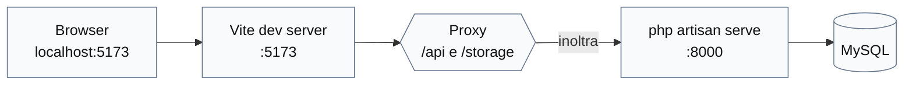
```mermaid
flowchart LR
    DEV["Browser<br/>localhost:5173"]
    VITE["Vite dev server<br/>:5173"]
    PROXY{{"Proxy<br/>/api e /storage"}}
    LARAVEL["php artisan serve<br/>:8000"]
    MYSQL[("MySQL")]

    DEV --> VITE
    VITE --> PROXY
    PROXY -->|inoltra| LARAVEL
    LARAVEL --> MYSQL

    classDef n fill:#f8fafc,stroke:#64748b,color:#111
    class DEV,VITE,PROXY,LARAVEL,MYSQL n
```

In sviluppo le chiamate partono da `/api/v1` sulla stessa origine e Vite le inoltra a Laravel: **non serve configurare CORS**, perché per il browser non c'è alcuna richiesta cross-origin. In produzione si imposta `VITE_API_URL` con il dominio reale dell'API e la configurazione CORS del backend entra in gioco.

---

## Riepilogo dei diagrammi

| N. | Tipo UML | Contenuto |
|---|---|---|
| 1.2–1.5 | Casi d'uso | 36 casi d'uso distribuiti su 3 attori più i condivisi |
| 1.6 | Scenario testuale | Prenotazione, con 6 flussi alternativi |
| 2.1–2.2 | Classi | Entità del dominio con attributi, metodi e cardinalità |
| 2.3 | Classi (pattern) | Architettura a livelli con gli stereotipi |
| 2.4 | Classi | Livello dei service e loro dipendenze |
| 3.1 | Sequenza | Prenotazione concorrente con blocco pessimistico |
| 3.2 | Sequenza | Autenticazione con difesa dal brute force |
| 3.3 | Sequenza | Conclusione visita ed emissione automatica della fattura |
| 3.4 | Sequenza | Token scaduto e logout automatico lato client |
| 4.1–4.3 | Stati | Cicli di vita di appuntamento, fattura e richiesta |
| 5.1 | Componenti | Architettura di deployment |
| 5.2 | Componenti | Ambiente di sviluppo con proxy |

---

*I diagrammi sono scritti in Mermaid e versionati insieme al codice: GitHub li renderizza nativamente. In caso di divergenza fra un diagramma e il codice, fa fede il codice.*
