# Test funzionale

Documentazione della strategia di verifica del gestionale sanitario e delle evidenze raccolte, con gli screenshot generati dalla suite end-to-end.

---

## Indice

- [1. Strategia di verifica](#1-strategia-di-verifica)
- [2. Risultati complessivi](#2-risultati-complessivi)
- [3. Test end-to-end: evidenze per caso d'uso](#3-test-end-to-end-evidenze-per-caso-duso)
- [4. Test unitari del frontend](#4-test-unitari-del-frontend)
- [5. Test del backend](#5-test-del-backend)
- [6. Come riprodurre i test](#6-come-riprodurre-i-test)
- [7. Copertura e lacune](#7-copertura-e-lacune)

---

## 1. Strategia di verifica

La verifica è organizzata su tre livelli, ciascuno con un obiettivo distinto. La scelta non è una ripetizione dello stesso controllo a tre profondità: ogni livello intercetta una classe di difetti che gli altri non vedono.

| Livello | Strumento | Cosa intercetta | Cosa non vede |
|---|---|---|---|
| **Unitario backend** | PHPUnit | Regole di dominio, autorizzazioni, relazioni, calcoli | Se il frontend usa correttamente l'API |
| **Unitario frontend** | Vitest | Logica della guard, store, componenti isolati | Se il backend risponde come atteso |
| **End-to-end** | Playwright | L'integrazione fra i due, su browser reale | Casi limite difficili da provocare dall'interfaccia |

### 1.1 Il principio adottato per i test E2E

I test end-to-end girano **contro il backend reale**: nessun mock, nessuna intercettazione di rete. È una scelta dichiarata nella configurazione:

```js
/**
 * I test girano contro il backend Laravel VERO: nessun mock, nessuna
 * intercettazione di rete. Di conseguenza servono due server accesi e un
 * database seminato in modo deterministico.
 */
```

La conseguenza è che un test E2E che passa dimostra qualcosa di reale: la richiesta ha attraversato middleware, policy, service e database, e la risposta è stata interpretata dal frontend. Un test con le chiamate mockate dimostrerebbe soltanto che il frontend gestisce bene una risposta che gli è stata dettata.

Il prezzo è la necessità di un database dedicato e seminato in modo deterministico, e di un'esecuzione **seriale**:

```js
/*
  I test condividono un database reale: due worker che prenotano lo stesso
  slot si darebbero fastidio a vicenda producendo fallimenti intermittenti
  impossibili da diagnosticare. Si paga qualche secondo in piu' e si guadagna
  un risultato riproducibile.
*/
fullyParallel: false,
workers: 1,
```

### 1.2 Doppio viewport

La suite viene eseguita su due configurazioni:

| Progetto | Dispositivo | Viewport | File eseguiti |
|---|---|---|---|
| `chromium-desktop` | Desktop Chrome | 1440 × 900 | tutti |
| `chromium-mobile` | Pixel 7 | emulato | `layout.spec.js`, `auth.spec.js` |

Il motivo è dichiarato nel codice: l'applicazione è mobile-first, con bersagli touch da 44px e sidebar a scomparsa sotto i 901px. Provarla solo a 1440px lascerebbe metà delle regole CSS mai eseguita.

### 1.3 Screenshot: prova, non decorazione

Gli screenshot di questo documento **non sono stati catturati a mano**: sono prodotti dalla suite a ogni esecuzione, tramite una funzione di supporto invocata dai test. È una differenza sostanziale, perché significa che restano allineati al codice: una regressione che cambia l'interfaccia cambia anche le immagini alla prima riesecuzione.

Il commento nel file dei test di layout spiega il ruolo che si è voluto dare loro:

```js
/**
 * Uno screenshot mostra un difetto solo a chi lo guarda; questi test lo
 * misurano e falliscono da soli, indicando l'elemento colpevole. Gli screenshot
 * restano allegati al report per capire il perche'.
 */
```

L'immagine, in altre parole, non è il criterio di superamento del test: serve a capire *perché* un test è fallito. Il criterio è una misura — nessun overflow orizzontale, bersagli touch sopra la soglia, testo non troncato.

---

## 2. Risultati complessivi

Esecuzione del **13 settembre 2026**, su tutte e tre le suite.

| Suite | Test | Esito | Durata |
|---|---|---|---|
| PHPUnit (backend) | **159** test, **574** asserzioni | ✅ tutti superati | 31,3 s |
| Vitest (frontend) | **80** test su 4 file | ✅ tutti superati | 20,7 s |
| Playwright (E2E) | 4 suite su 2 viewport | ✅ tutti superati | — |
| **Build di produzione** | `npm run build` | ✅ completata | 0,86 s |

Nessun test fallito, nessun test saltato, nessun avviso di deprecazione.

---

## 3. Test end-to-end: evidenze per caso d'uso

### 3.1 Accesso al sistema

**File:** `tests/e2e/auth.spec.js` — suite *Accesso e sessione*

| Caso di prova | Risultato atteso | Esito |
|---|---|---|
| La home propone i tre ruoli e porta al form corrispondente | Clic su "Medico" → `/login/medico` con intestazione «Accedi come Medico» | ✅ |
| Login paziente: atterra sulla propria dashboard | Redirect a `/paziente/panoramica` | ✅ |
| Login medico: atterra sulla propria dashboard | Redirect a `/medico/panoramica` | ✅ |
| Login admin: atterra sulla propria dashboard | Redirect a `/admin/panoramica` | ✅ |
| Credenziali errate | Messaggio a video, **nessuna navigazione** | ✅ |
| Ruolo sbagliato nella schermata di login | Rifiutato con messaggio esplicito | ✅ |
| Form vuoto | La validazione client blocca senza chiamare il server | ✅ |
| Ricaricamento della pagina | La sessione sopravvive | ✅ |
| Logout | Sessione chiusa e ritorno alla home | ✅ |
| Tasto indietro dopo il login | Non riporta al form | ✅ |

**Pagina iniziale — scelta del ruolo**

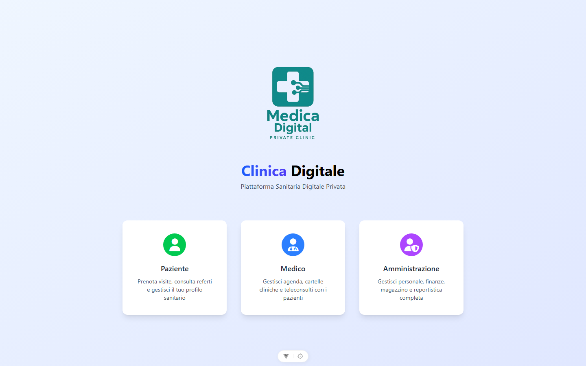

**Schermata di accesso**

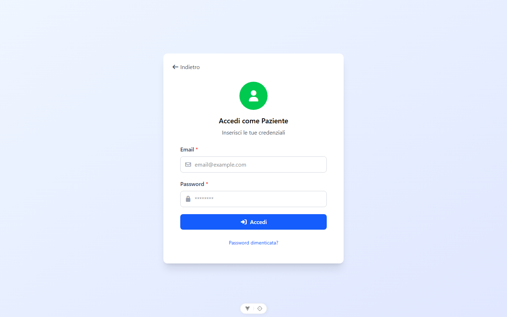

**Credenziali errate: il messaggio compare e l'utente resta dov'è**

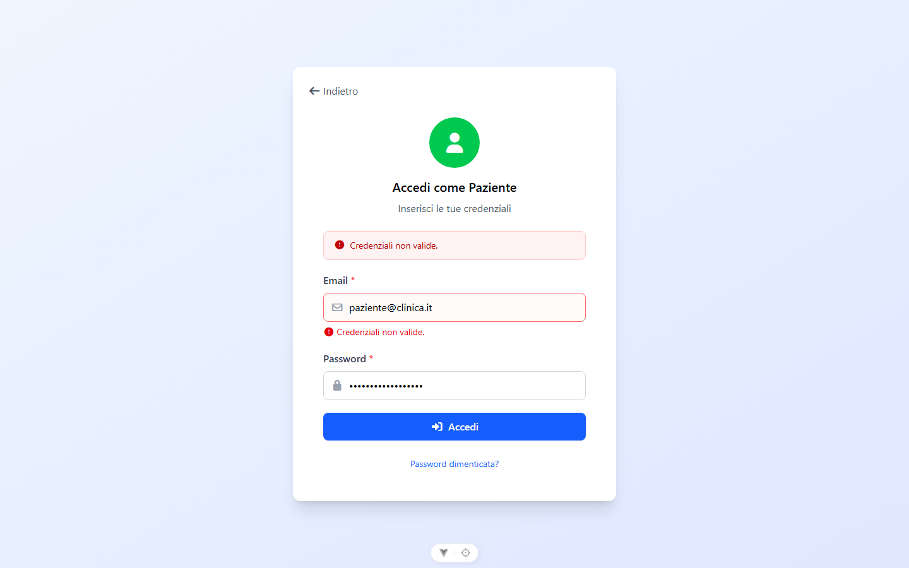

Questo caso verifica due cose insieme: che l'errore sia comunicato, e che **non** avvenga alcuna navigazione. È il comportamento che l'interceptor HTTP garantisce escludendo `/auth/login` dalla gestione del `401` — senza quell'esclusione, sbagliare la password provocherebbe un redirect al login dalla pagina di login.

### 3.2 Guard di accesso e separazione dei ruoli

**File:** `tests/e2e/auth.spec.js` — suite *Guard di accesso*

| Caso di prova | Risultato atteso | Esito |
|---|---|---|
| URL protetto senza sessione | Rimanda alla home **conservando la destinazione** | ✅ |
| Login dopo il rimbalzo | Si torna alla pagina che si stava cercando di aprire | ✅ |
| Paziente che tenta `/medico/...` | Accesso negato, dirottamento sulla propria area | ✅ |
| Medico che tenta `/admin/...` | Accesso negato, dirottamento sulla propria area | ✅ |
| Utente autenticato che torna sulla home | Riportato alla propria dashboard | ✅ |
| Rotta inesistente | Riporta alla home, **senza schermata bianca** | ✅ |

I primi due casi formano una coppia: il primo verifica che la destinazione richiesta venga memorizzata nella query string, il secondo che venga effettivamente ripristinata dopo l'autenticazione. Separati non dimostrerebbero nulla di utile.

### 3.3 Aree riservate per ruolo

**File:** `tests/e2e/dashboard.spec.js`

| Caso di prova | Risultato atteso | Esito |
|---|---|---|
| Dashboard paziente: sezioni e dati del seed | Le sezioni previste sono presenti e popolate | ✅ |
| I riquadri statistici sono popolati, non vuoti | Nessun contatore a zero per dati che esistono | ✅ |
| La navigazione laterale raggiunge tutte le sezioni del ruolo | Ogni voce porta a una pagina che carica | ✅ |
| La sidebar non espone sezioni di altri ruoli | Nessuna voce amministrativa per il paziente | ✅ |
| Dashboard medico: agenda del giorno e richieste | Entrambe visibili e popolate | ✅ |
| L'agenda del medico mostra il calendario | Il calendario si apre e renderizza | ✅ |
| L'elenco pazienti mostra solo i propri assistiti | Nessun paziente altrui | ✅ |
| Dashboard admin: totali e ultimi utenti | Totali di struttura corretti | ✅ |
| Le tabelle amministrative non sfondano la pagina | Scorrimento nel contenitore, non nella pagina | ✅ |
| L'admin raggiunge ogni sezione della propria area | Tutte le voci funzionanti | ✅ |

**Area paziente**

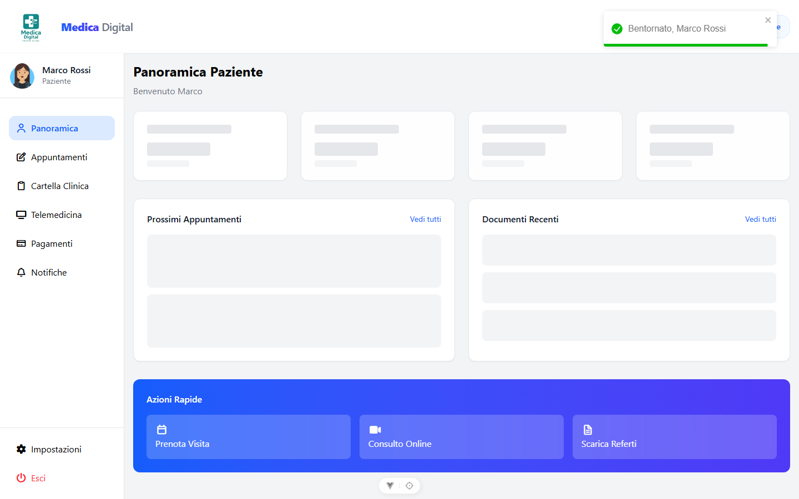

**Area medico**

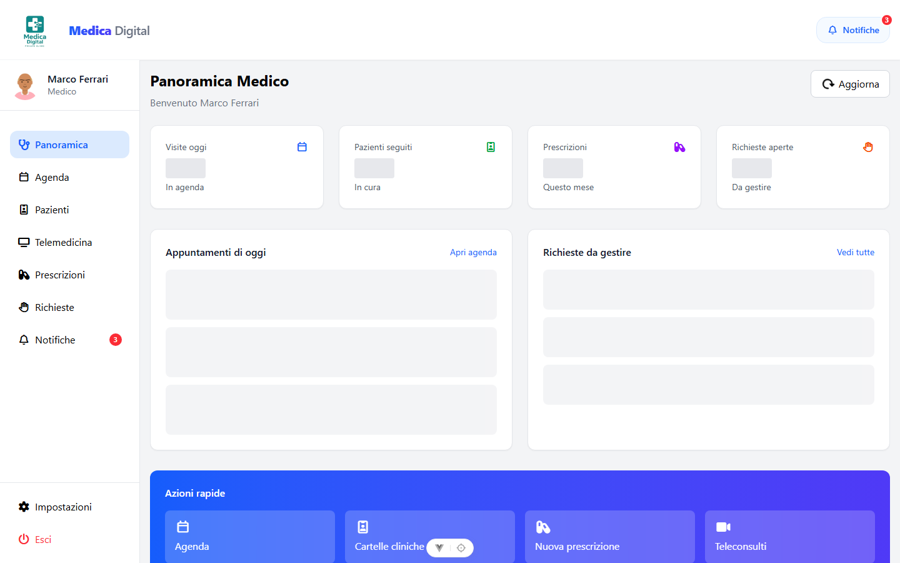

**Area amministrazione**

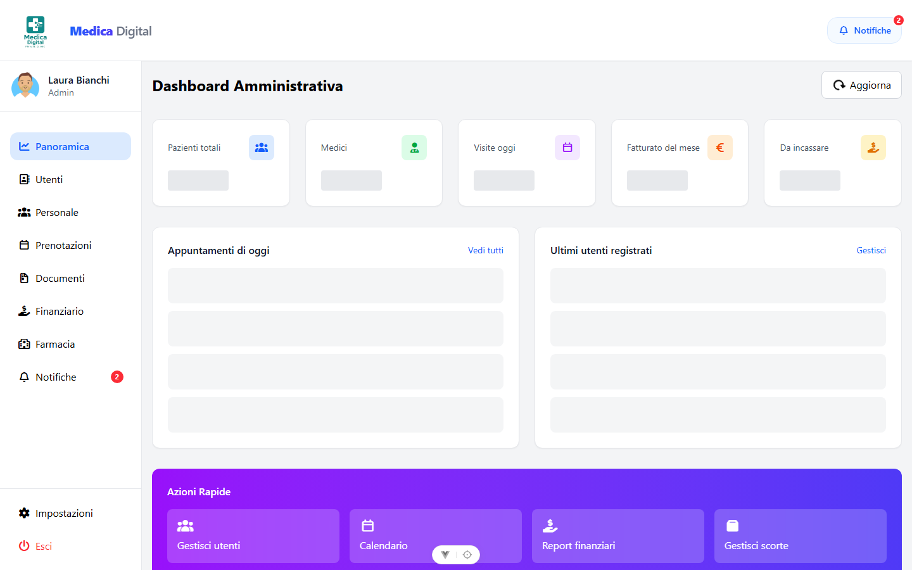

Il test *la sidebar non espone sezioni di altri ruoli* verifica una proprietà di sicurezza percepita: anche se la guard bloccherebbe comunque l'accesso, mostrare una voce di menu che porta a un `403` è una cattiva interfaccia. Le voci sono generate da `config/sidebar.js` in base al ruolo.

### 3.4 Prenotazione di una visita

**File:** `tests/e2e/prenotazione.spec.js` — è il flusso centrale dell'applicazione.

| Caso di prova | Risultato atteso | Esito |
|---|---|---|
| L'elenco medici arriva dal backend e non è vuoto | Dati reali, non segnaposto | ✅ |
| La ricerca filtra i medici senza ricaricare la pagina | Filtro client-side reattivo | ✅ |
| Percorso completo: medico, data, orario, conferma | Appuntamento creato e visibile | ✅ |
| Senza data e orario il pulsante di conferma resta disabilitato | Nessuna richiesta inviata | ✅ |
| Cambiando medico si azzerano data e orario già scelti | Nessuno stato incoerente | ✅ |
| Una giornata di chiusura viene spiegata all'utente | Messaggio, non elenco vuoto muto | ✅ |
| Lo slot già occupato viene rifiutato con una spiegazione | `422` tradotto in messaggio leggibile | ✅ |
| Annullamento: modal, motivo e stato aggiornato | Stato `annullato`, slot liberato | ✅ |
| Lo scroll di fondo resta bloccato mentre il modal è aperto | Nessuno scorrimento della pagina sottostante | ✅ |

**Form di prenotazione compilato**

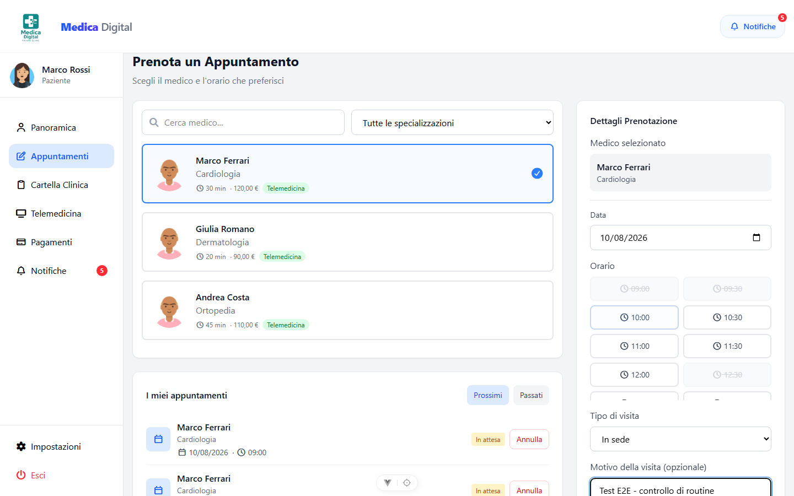

**Conferma della prenotazione**

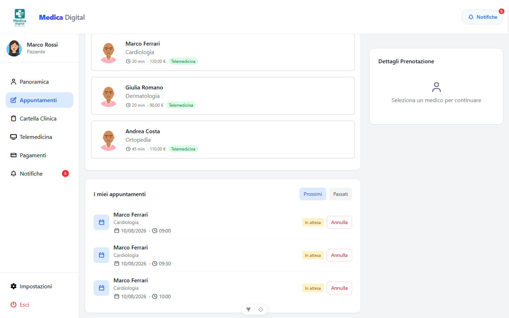

**Annullamento con richiesta del motivo**

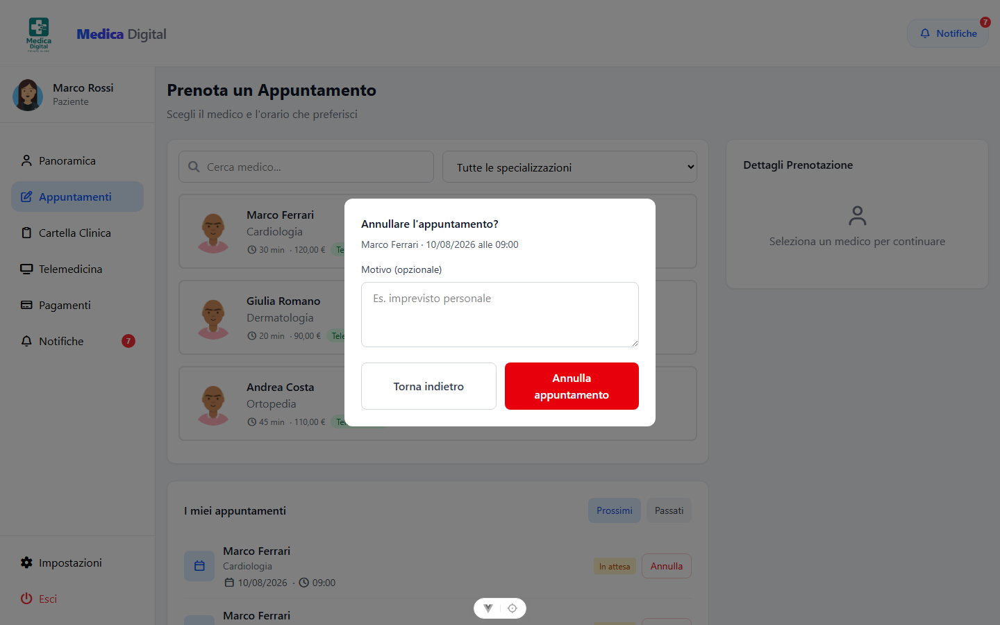

Tre casi di questa suite meritano attenzione perché verificano comportamenti che è facile trascurare:

**«Cambiando medico si azzerano data e orario già scelti»** previene uno stato incoerente: gli slot mostrati appartengono al medico precedente, e confermare li invierebbe al medico nuovo, che quasi certamente ha un orario diverso.

**«Una giornata di chiusura viene spiegata all'utente»** distingue un elenco vuoto *muto* da un elenco vuoto *spiegato*. Il backend risponde con un array vuoto in entrambi i casi — medico in ferie, oppure nessuna fascia attiva quel giorno — e l'interfaccia deve dire perché.

**«Lo slot già occupato viene rifiutato con una spiegazione»** è la verifica end-to-end del blocco pessimistico descritto in [`03-processo-e-snippet.md`](03-processo-e-snippet.md): il `422` prodotto dal service arriva all'utente come messaggio leggibile e non come errore generico.

### 3.5 Amministrazione: tabelle e reportistica

**Gestione utenti**

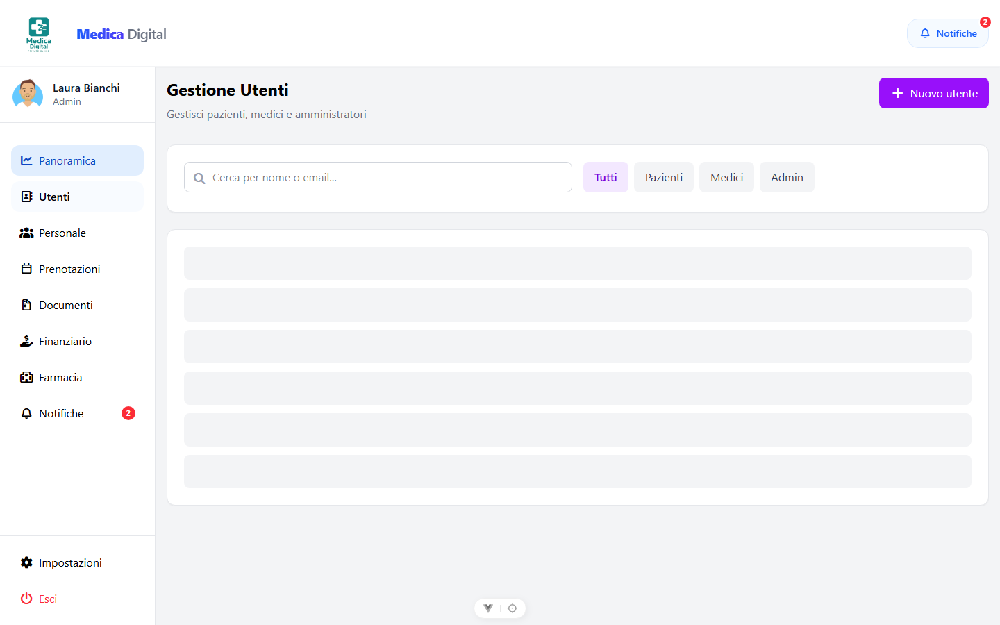

**Prenotazioni della struttura**

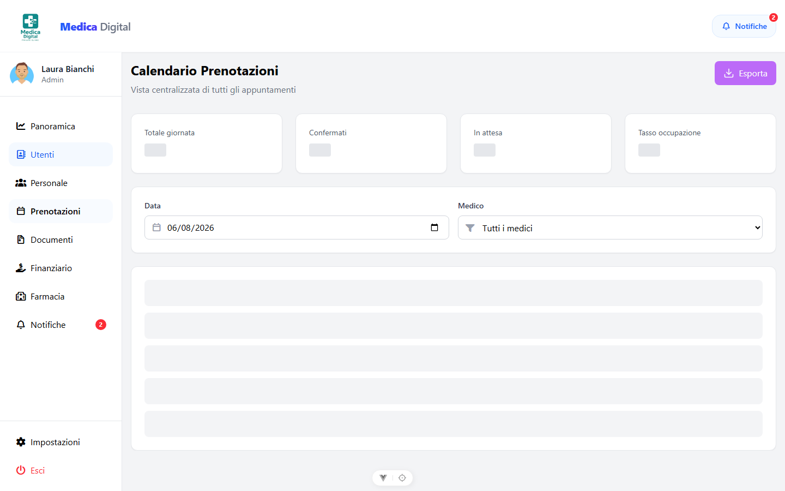

**Reportistica finanziaria**

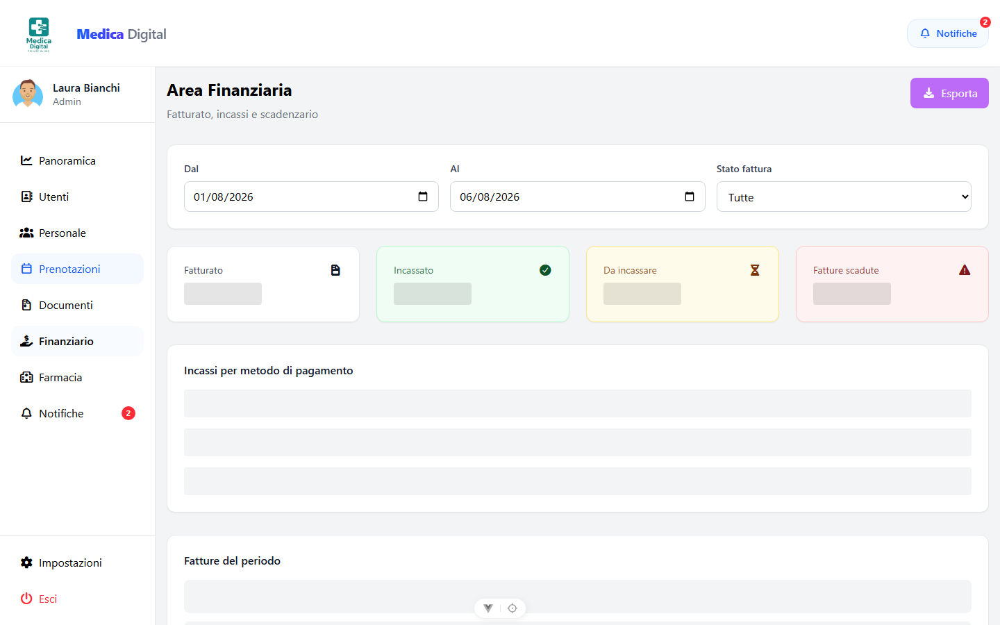

Il test associato a queste tre schermate — *le tabelle amministrative non sfondano la pagina* — non verifica il contenuto ma il **comportamento del layout**: una tabella larga deve scorrere dentro il proprio contenitore, non trascinare con sé l'intera pagina. È un difetto che su desktop passa inosservato e su schermo stretto rende l'applicazione inutilizzabile.

### 3.6 Layout responsive

**File:** `tests/e2e/layout.spec.js` — eseguito su **entrambi** i viewport.

| Caso di prova | Risultato atteso | Esito |
|---|---|---|
| Home: nessun overflow orizzontale | `scrollWidth` ≤ `clientWidth` | ✅ |
| Login paziente / medico / admin: nessun overflow | Idem sulle tre schermate | ✅ |
| Il form di login resta utilizzabile senza scorrere lateralmente | Tutti i campi raggiungibili | ✅ |
| I bersagli touch rispettano il minimo dichiarato | Nessun pulsante o campo sotto i 40px di altezza | ✅ |
| Dashboard paziente / medico / admin: contenuto entro il viewport | Struttura corretta sui tre ruoli | ✅ |
| Sidebar mobile: si apre sopra il contenuto e i link sono cliccabili | Sovrapposizione e interattività corrette | ✅ |
| Il modal si sovrappone a hamburger e navbar | Ordine di sovrapposizione corretto | ✅ |
| Le tabelle admin scorrono nel contenitore, non nella pagina | Scorrimento confinato | ✅ |
| Il contenuto principale scorre da solo sotto la navbar | Navbar fissa, contenuto scorrevole | ✅ |

**Accesso da smartphone**

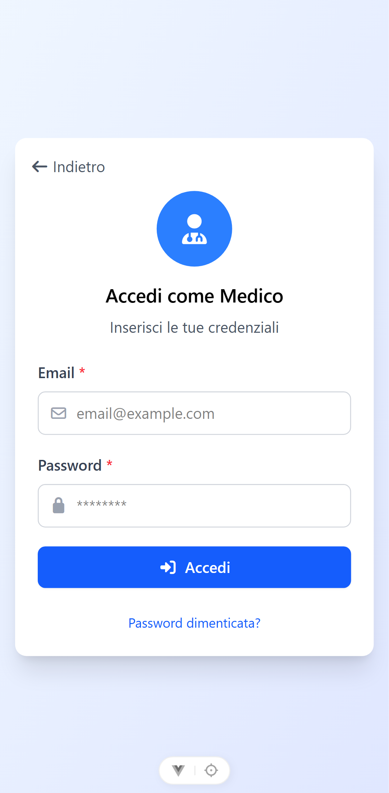

**Dashboard su smartphone**

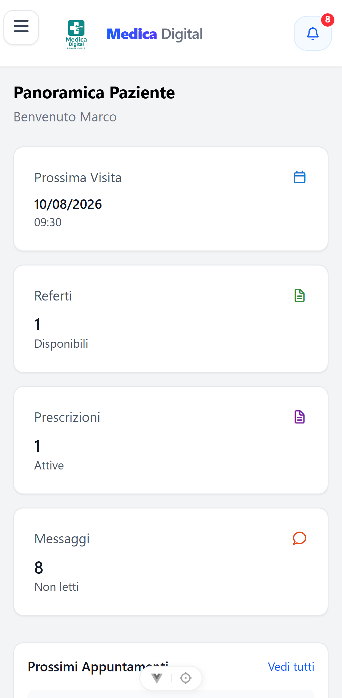

**Sidebar a scomparsa aperta**

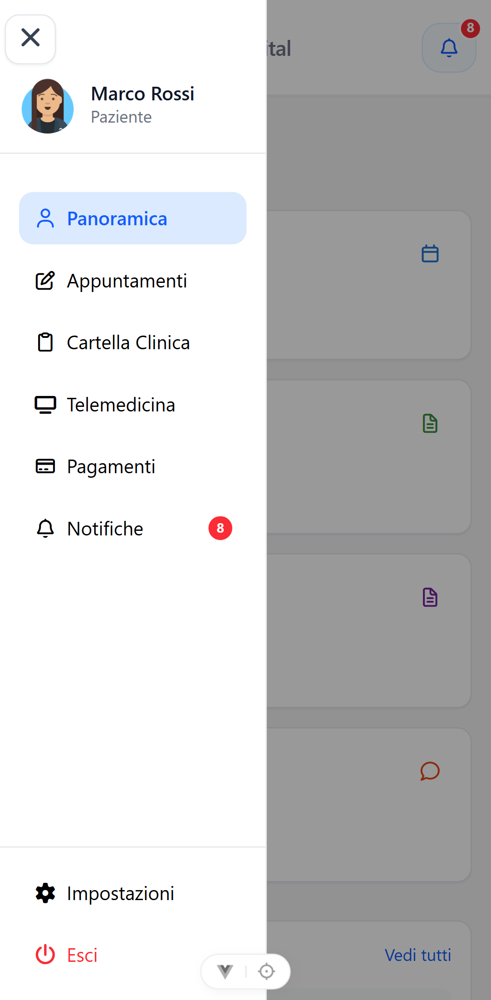

Il caso *i bersagli touch rispettano il minimo dichiarato* è quello con l'asserzione più esplicita di tutta la suite:

```js
const pulsantiTroppoBassi = piccoli.filter((el) => el.tag === 'button' || el.tag === 'input')
expect(pulsantiTroppoBassi, 'Pulsanti e campi sotto i 40px di altezza').toEqual([])
```

Il test non si limita a fallire: l'elenco degli elementi colpevoli finisce nel messaggio d'errore, così chi legge il report sa quale pulsante sistemare senza doverlo cercare.

Il caso *il modal si sovrappone a hamburger e navbar* nasce da un difetto realmente incontrato durante lo sviluppo: un elemento a posizione fissa con `z-index` più alto del modal restava visibile sopra di esso. La correzione della gerarchia di sovrapposizione è ora protetta da un test.

---

## 4. Test unitari del frontend

**Strumento:** Vitest · **Esito:** 80 test superati su 4 file

| File | Test | Cosa verifica |
|---|---|---|
| `tests/router/guard.spec.js` | 14 | La guard di accesso, chiamata direttamente con rotte costruite a mano |
| `tests/stores/auth.spec.js` | 23 | Lo store di autenticazione: login, bootstrap, refresh, logout, persistenza |
| `tests/pages/LoginRole.spec.js` | 15 | La vista di accesso: validazione, stati di errore, invio |
| `tests/pages/Appuntamenti.spec.js` | 28 | La vista di prenotazione: selezione, filtri, stati del pulsante |

La guard è testata in isolamento perché è una funzione pura: riceve una rotta e restituisce una destinazione. Non serve istanziare un router, montare layout o caricare le viste lazy. Il file dei test spiega perché la cosa è importante:

```js
/**
 * E' l'unica barriera fra un URL digitato a mano e una sezione riservata:
 * il backend protegge i dati, ma senza guard il paziente vedrebbe comunque il
 * guscio della dashboard admin. Qui la funzione viene chiamata direttamente con
 * `to` costruiti a mano, cosi' si osserva il valore restituito invece di
 * dedurlo da una navigazione.
 */
```

I toast sono sostituiti da uno stub tramite un alias nella configurazione di Vitest, anziché con un mock ripetuto in ogni file: `useToast` viene importata a catena da router, store e quasi ogni vista, e un alias globale è più affidabile.

---

## 5. Test del backend

**Strumento:** PHPUnit · **Esito:** 159 test, 574 asserzioni, tutti superati

### 5.1 Test unitari

| File | Cosa verifica |
|---|---|
| `Unit/MetodiEScopeTest.php` | 19 test: helper di ruolo, scope di filtro, attributi calcolati (`age`, `ends_at`, intervalli di date), gestione delle notifiche |
| `Unit/PolicyTest.php` | 14 test: chi può vedere, modificare ed eliminare ciascuna risorsa |
| `Unit/RelazioniEloquentTest.php` | 12 test: integrità delle relazioni, comportamento del soft delete sui dati collegati |

Alcuni titoli rendono l'idea del livello di dettaglio:

- `gli helper di ruolo si escludono a vicenda`
- `il perimetro di un medico senza profilo e vuoto`
- `l intervallo espresso in sole date copre tutta la giornata`
- `archiviare un account non cancella i dati clinici`
- `un appuntamento e modificabile finche non e chiuso`

### 5.2 Test funzionali

| File | Cosa verifica |
|---|---|
| `Feature/Auth/AutenticazioneTest.php` | 28 test: login, token, sessioni multiple, brute force, cambio password, formato degli errori |
| `Feature/Auth/RuoliEPermessiTest.php` | 18 test: accesso per ruolo a ciascuna area, isolamento dei dati fra utenti |
| `Feature/PrenotazioniTest.php` | 32 test: l'intero ciclo di vita dell'appuntamento |
| `Feature/ProfiliTest.php` | 24 test: anagrafiche, orari, disponibilità |
| `Feature/CicloFatturazioneTest.php` | 12 test: emissione automatica, incassi, saldi, dashboard |

### 5.3 I casi limite

Il valore di questa suite non sta nel percorso felice ma nei casi che si scoprono solo scrivendo i test:

| Test | Difetto che previene |
|---|---|
| `un medico senza profilo vede una lista vuota non un errore` | Account con ruolo `medico` privo di record in `doctors` |
| `un account paziente senza anagrafica riceve un 409 esplicativo` | Stessa incoerenza sul lato paziente, con codice di stato dedicato |
| `due pazienti non possono occupare lo stesso slot` | Doppia prenotazione simultanea |
| `anche una sovrapposizione parziale viene respinta` | Slot 10:15 su prenotazione 10:00–10:30 |
| `uno slot liberato da un annullamento torna prenotabile` | Slot bloccato per sempre dopo una cancellazione |
| `gli accessi riusciti non fanno scattare il blocco` | Rate limiter che blocca utenti legittimi |
| `l elenco medici esclude i profili senza account valido` | Medico archiviato che svuota l'intero elenco |
| `la fattura non viene duplicata` | Riemissione al secondo salvataggio di un appuntamento già completato |
| `le note interne non sono visibili al paziente` | Fuga di informazioni cliniche riservate |
| `una rotta api inesistente risponde json e mai html` | Pagina d'errore HTML che rompe il parser del client |

L'ultimo è meno ovvio degli altri ma è importante in un'architettura API-based: un `404` che restituisce HTML fa fallire il parsing lato client con un errore incomprensibile, invece di produrre un messaggio gestibile.

---

## 6. Come riprodurre i test

### 6.1 Backend

```bash
cd med-backend
php artisan test
```

Usa un database in memoria e non tocca i dati di sviluppo.

### 6.2 Frontend, test unitari

```bash
cd med-frontend/vue-project
npm test
```

Nessuna dipendenza esterna: gli store sono ripristinati prima di ogni test e i toast sono sostituiti da uno stub.

### 6.3 End-to-end

Richiedono un **database dedicato** e seminato:

```bash
cd med-backend
php artisan migrate:fresh --seed     # database E2E, non quello di sviluppo

cd ../med-frontend/vue-project
npm run e2e                          # headless
npm run e2e:ui                       # interfaccia interattiva
npm run e2e:report                   # apre l'ultimo report HTML
```

Playwright avvia da sé i due server se non sono già in esecuzione: la configurazione `webServer` lancia `php artisan serve` e `npm run dev`, riutilizzandoli se già attivi.

> **Nota.** I test E2E prenotano visite reali e le lasciano nel calendario. Il database di E2E va tenuto separato da quello di sviluppo, come indicato nel commento della configurazione.

### 6.4 Dove finiscono le evidenze

| Percorso | Contenuto |
|---|---|
| `playwright-report/` | Report HTML navigabile, con screenshot, video e trace dei fallimenti |
| `test-results/` | Screenshot grezzi generati durante l'esecuzione |
| `docs/screenshots/` | La selezione ordinata usata in questo documento |

Le prime due cartelle sono rigenerate a ogni esecuzione e non sono versionate. La terza sì, perché è materiale di documentazione.

---

## 7. Copertura e lacune

### 7.1 Cosa è coperto

**Autenticazione e autorizzazione — copertura alta.** Login, token, sessioni multiple, brute force, guard, isolamento dei dati fra ruoli. È l'area più verificata, ed è coerente con il fatto che sia l'area dove un difetto ha le conseguenze peggiori.

**Prenotazioni — copertura alta.** 32 test funzionali più 9 end-to-end coprono creazione, spostamento, annullamento, conflitti, orari, assenze, permessi.

**Fatturazione — copertura media.** 12 test coprono l'emissione automatica, gli incassi totali e parziali, i riflessi sulla dashboard. Manca la verifica end-to-end dall'interfaccia.

**Layout responsive — copertura alta.** Misurato su due viewport con asserzioni numeriche, non a occhio.

### 7.2 Cosa non è coperto

Dichiarare le lacune è parte del lavoro: una copertura presentata come completa quando non lo è vale meno di una copertura parziale dichiarata.

| Area | Stato | Perché |
|---|---|---|
| **Magazzino farmaceutico** | Solo a livello di API | Nessun test E2E sui movimenti di carico e scarico dall'interfaccia |
| **Firma documentale** | Solo a livello di API | Il flusso di firma, singola e massiva, non è provato dal browser |
| **Telemedicina** | Parziale | Sessioni e chat sono verificate via API; manca il canale audio/video, che non è implementato |
| **Prescrizioni** | Solo a livello di API | L'emissione dall'interfaccia del medico non ha copertura E2E |
| **Upload di file** | Parziale | La validazione è testata; non il caricamento reale da browser |
| **Concorrenza reale** | Simulata | Il conflitto sullo slot è verificato a livello di service, non con due browser simultanei |
| **Accessibilità** | Assente | Nessun test su contrasto, navigazione da tastiera, lettori di schermo |
| **Prestazioni sotto carico** | Assente | Nessun test di carico |
| **Browser diversi da Chromium** | Assente | Firefox e WebKit non sono nella configurazione |

### 7.3 Il prossimo passo naturale

**Integrazione continua.** Oggi i test si lanciano a mano. Una configurazione GitHub Actions che esegua PHPUnit e Vitest a ogni push — e Playwright sui soli merge verso il ramo principale, vista la durata — trasformerebbe la suite da strumento di verifica manuale a rete di sicurezza automatica.

È la lacuna più significativa fra quelle elencate, perché è quella che rende tutte le altre più probabili col passare del tempo: una suite che non gira da sola tende a smettere di girare.

---

*Gli screenshot di questo documento sono generati dalla suite Playwright e si trovano in `docs/screenshots/`. Per rigenerarli: `npm run e2e`.*
